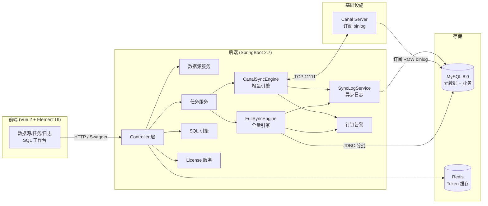

# 开源一款可视化 MySQL 数据同步工具 DataMove：零代码玩转全量 + Canal 增量同步

> 副标题：一个基于 RuoYi-Vue 二次开发的轻量级 ETL 平台，专治"DBA 跑路 / DataX 配错 / Canal 命令行劝退"。

---

## 一、为什么要造这个轮子？

我们团队过去三年踩过太多次坑：

| 场景 | 现状 | 痛点 |
| --- | --- | --- |
| 业务库拆分（订单库 → 订单中台库） | 用 DataX 写 JSON | 字段映射要手写 joiner，运维同事上手成本高 |
| 实时订阅 binlog | 部署 Canal + 写 Kafka 消费 | 要懂 canal 协议 + 位点 + 多线程 ack，错一次就丢数据 |
| DBA 离职交接 | 几个脚本散落在跳板机 | 新人接手无从下手，权限审计一塌糊涂 |
| 临时数据修复 | 程序员手动 `INSERT ... SELECT` | 容易把生产主键写崩，且没日志 |

于是就有了 `DataMove` —— **把数据同步做成"配置即任务"**：选源库 → 选目标库 → 选表 → 点启动，再在浏览器里看日志、收钉钉告警。

项目代码完全开源，二级拿到手就能直接用。

---

## 二、它能做什么？

```
┌────────────────────────────────────────────────────────────┐
│                       DataMove 能力地图                     │
├──────────────┬─────────────────────────────────────────────┤
│ 数据源       │ MySQL 5.7 / 8.x，多源并存，密码 AES 加密存储  │
│ 全量同步     │ 按主键 ID / 按时间字段，断点续传、幂等覆盖    │
│ 增量同步     │ 基于 Canal 1.1 订阅 binlog，自动 ACK + 位点  │
│ SQL 工作台   │ CodeMirror 编辑器，多语句、Ctrl+Enter 执行   │
│ 数据浏览     │ 在线分页浏览任意已注册数据源（带行数统计）    │
│ 同步日志     │ 批次明细 + 总进度，支持 CSV 导出             │
│ 告警         │ 钉钉 Webhook 主动推送（启动失败/中断/对账异常）│
│ 授权         │ MAC + LicenseKey 一机一绑，离线可用          │
│ 权限         │ admin / operator 两级 RBAC                   │
└──────────────┴─────────────────────────────────────────────┘
```

对比 DataX / Canal-adapter / DTS 这些"老炮"，DataMove 的优势是 **零代码 + 全中文 + 自带可视化 + 自带授权**，适合中小团队"开箱即用"。

---

## 三、整体架构



核心模块仅 ~4 个 Java 包：

```
com.ruoyi.datamove
├── datasource      // 数据源管理
├── task            // 同步任务 CRUD
├── engine
│   ├── full        // FullSyncEngine  (断点续传 + 幂等)
│   ├── incr        // CanalSyncEngine (增量 + 位点 ACK)
│   └── log         // SyncLogService  (批次明细)
├── browse          // 在线浏览数据
├── license         // 离线授权校验
└── log             // 日志导出 controller
```

---

## 四、关键技术点 1：全量同步的"双引擎 + 断点续传 + 幂等"

### 4.1 两种同步模式

| 模式 | 适用场景 | WHERE 片段 |
| --- | --- | --- |
| **按主键 ID** | 几乎所有业务表 | `WHERE id > #{lastId} LIMIT #{batchSize}` |
| **按时间字段** | 没有自增主键的表 / 日志型表 | `WHERE time > #{lastTime} OR (time = #{lastTime} AND id > #{lastIdInBatch})` |

按时间模式里"同秒数据"的处理是关键：先用 `time = #{lastTime} AND id > #{lastIdInBatch}` 把同秒内剩余行捞完，再推进 `lastTime`，彻底解决"漏数据 / 重复拉取"。

### 4.2 断点续传的核心原则

> **整批 INSERT 成功 → 才更新 `lastSyncMaxId/lastSyncTime`**

伪代码：

```java
while (有下一批) {
    rows = selectByCondition(lastId);
    try {
        tx.begin();
        batchInsertOrUpdate(rows);      // ON DUPLICATE KEY UPDATE
        updateProgress(lastId = rows.lastId);   // ✅ 仅成功才推进
        tx.commit();
    } catch (Exception e) {
        tx.rollback();
        // 下次启动会从 lastId 重新拉这一批
    }
}
```

- **崩溃重启**：自动从上次 `lastSyncMaxId` 继续，不会丢也不会重复。
- **重复执行安全**：`INSERT ... ON DUPLICATE KEY UPDATE` 是 MySQL 幂等标准写法。

### 4.3 整批 `ON DUPLICATE KEY UPDATE` 而不是 `REPLACE INTO`：

`REPLACE` 会先 `DELETE` 旧行，对带 `AUTO_INCREMENT` 的表会改主键、并触发级联删除；`ON DUPLICATE KEY UPDATE` 只 update 既有列，幂等且不破坏外键。

---

## 五、关键技术点 2：Canal 增量同步 + 位点 ACK

### 5.1 同步流程

```
启动 → CanalConnector.connect() → subscribe(filter) → 循环 getWithoutAck(1000)
                                     ↓
                       apply(CanalEntry) → JDBC applyRowData()
                                     ↓
                          getAck(batchId)   // ✅ 处理成功才 ack
                                     ↓
                          更新 sync_canal_position 表
```

### 5.2 反向回环防护

源端写入的目标库也会产生 binlog，会被 Canal 误"二次同步"。
DataMove 用 **库名白名单 + 任务级 destination** 两层过滤：

- Canal 配置里只订阅 `datamove` 库的 `data_move_test` 表（精确过滤）。
- 每个任务绑定独立 `destination`，一个任务一个订阅通道。

### 5.3 失败回滚

```java
try {
    apply(events);          // 写目标库
    connector.ack(batchId); // ✅ 推进位点
} catch (Exception e) {
    connector.rollback(batchId); // ❌ 不 ack，下次重做
    sync_canal_position 不更新;
    触发钉钉告警;
}
```

> 关键设计：**位点更新必须在 `ack` 之后**，否则一旦程序在 update position 前崩溃，重启会丢事件。

---

## 七、关键技术点 3：SQL 工作台（运维救场神器）

数据同步之外，DataMove 还附带一个 Web 版的 SQL 工作台：

- CodeMirror 6 编辑器，支持 MySQL 关键字高亮 + 智能补全（`Ctrl + Space`）。
- 多语句执行，按分号拆分，每个语句单独展示结果。
- 查询结果 1000 行上限，超过提示；可一键导出 **Excel / CSV**。
- `Ctrl + Enter` 执行当前选中或全部，效率直逼本地 Navicat。
- 操作历史：每次执行保留在页面内，点 tag 可回填到编辑器。

> DBA 哥哥再也不用远程登录服务器开 SSH 隧道了。

---

## 八、同步日志：批次级粒度 + CSV 导出

`SyncLogService` 会在每个批次结束后异步写入 `sync_task_log`：

| 字段 | 含义 |
| --- | --- |
| task_id | 任务 ID |
| task_name | 任务名 |
| sync_mode | FULL / INCR |
| batch_no | 批次号（增量任务记录 binlog 起止位点 `start_key` / `end_key`） |
| batch_rows | 本批处理行数 |
| total_rows | 累计已同步行数 |
| cost_ms | 本批耗时 |
| status | SUCCESS / FAILED |
| error_msg | 失败信息（FAILED 时填） |

- 全量任务：批次号天然递增。
- 增量任务：批次号 = canal message batchId；`start_key` / `end_key` 是 `binlog:offset`，**让管理员一眼能定位到具体 binlog 位置**。
- 支持按任务 ID、状态筛选，一键 CSV 导出（字段含 `start_key / end_key`）供运维追溯。

---

## 九、License：离线授权与续费

DataMove 以"私有化 jar + 月订阅"为商业模式：

- 启动期一次性联网校验 `licenseKey + mac + expireTime`。
- 启动成功后**完全离线运行**，不依赖云端。
- 校验维度：`LicenseKey 合法性` + `MAC 绑定` + `到期时间`。
- 过期前 7 天每天钉钉提醒；过期后下次启动直接拒绝。
- 管理员可在 Web 后台手动续期（不暴露 LicenseKey，只改过期时间）。

```java
// 启动校验：联网一次 + 失败也允许跑（首次注册 + 本地校验通过则通过）
public void verifyOnStartup() {
    String mac = MacUtils.getLocalMac();
    License local = licenseMapper.selectOne();
    if (local == null) {
        local = autoRegister30DaysTrial(mac);   // 首次启动送 30 天试用
    }
    if (!mac.equalsIgnoreCase(local.getMac())) throw new BusinessException("MAC 不匹配");
    if (local.getExpireTime().before(new Date())) throw new BusinessException("License 已过期");
    verifyOnlineAsync(local, mac);               // 联网校验仅记录日志，不阻塞启动
}
```

---

## 十、告警：钉钉 Webhook 主动推送

| 触发场景 | 推送内容 |
| --- | --- |
| 任务启动失败 / 数据源连不上 | `[DataMove告警] 任务[xxx] 启动失败: 源库连接失败` |
| 全量中断 / 增量 binlog 断开 | `[DataMove告警] 任务[xxx] 已中断, 请查看日志` |
| 单批次错误率超过阈值 | `[DataMove告警] 任务[xxx] 失败 N 条, 错误样本: ...` |

每条任务支持独立 Webhook，运维在钉钉群里就能秒级响应。

---

## 十一、十分钟跑起来

```bash
# 1. 初始化 MySQL
mysql -uroot -p < sql/datamove.sql

# 2. 启动后端
mvn clean package -DskipTests
java -jar target/datamove.jar
# → Swagger 文档: http://localhost:8080/swagger-ui/index.html

# 3. 启动前端
cd ruoyi-ui
npm install
npm run dev
# → http://localhost:80  账号 admin / admin123

# 4. （可选）Docker 起 Canal
docker compose -f docker/canal/docker-compose.yml up -d
```

首次登录后 4 步即可同步：
1. **授权管理** → 确认 License 状态（首次启动自动 30 天试用）。
2. **数据源** → 添加源库与目标库 → 点 "测试连接"。
3. **任务** → 新建任务（全量或增量）→ 点 "启动" → 在 "同步日志" 看实时进度。
4. **钉钉** → 在任务里填 Webhook → 异常自动推送到钉钉群。

---

## 十二、安全与权限

- 密码 / LicenseKey / 数据源密码全部入库前 AES 加密。
- 前端回显只显示 `前 2 位 **** 后 2 位`，明文绝不出现。
- Spring Security + JWT，路由级权限。
- 内置两种角色：
  - **admin**：全权，可改 License、可改数据源密码。
  - **operator**：仅查看任务、启停任务、看日志，零数据源操作权限。
- `admin` 默认密码首次登录强制修改。

---

## 十三、性能与稳定性经验

1. **JDBC 批写 1000 行/批**：经测试，`addBatch + executeBatch` 比单条 INSERT 快 50~80 倍；1000 行是吞吐与事务回滚成本的甜点。
2. **`setFetchSize(batchSize)`**：MySQL 驱动必须显式设才能流式取，否则会一次性把所有数据塞进内存（OOM 重灾区）。
4. **Canal 失败回滚**：见上文 §5.3。
5. **钉钉限流**：批量失败不并发推，最多保留最近 5 条事件，避免被风控。

---

## 十四、Roadmap（二期规划）

- [ ] DDL 同步（库表结构变更自动跟随）
- [ ] 多线程极速同步（按主键区间分片并行）
- [ ] 数据差异对账 + 一键修复
- [ ] 数据脱敏（手机号 / 身份证 / 邮箱）
- [ ] PostgreSQL / Oracle / 达梦支持
- [ ] SaaS 多租户 Web 版

---

## 十五、写在最后

DataMove 不是一个万能 ETL 平台，它的定位非常清晰：

> **给中小企业 / 个人 / 外包团队的"零代码 MySQL 同步工具"**。

如果你正被 DataX JSON 折磨、被 Canal 命令行劝退、被 DBA 离职搞得焦头烂额，不妨试试：

- GitHub：[项目地址]
- 文档：`README.md` + Swagger UI 一站式
- 反馈：欢迎提 Issue / PR

如果你觉得这个项目有帮助，欢迎 **Star ⭐** 鼓励一下作者，这也是开源最大的动力。

---

> 作者：DataMove 团队
> 发布平台：Jira · 掘金 · CSDN · 博客园 `自制即热，重在落地`