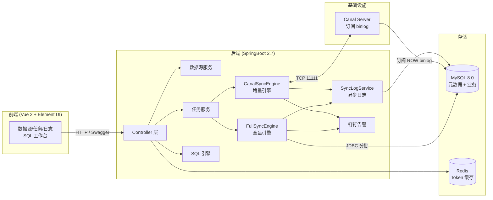

# 开源一款可视化 MySQL 数据同步工具 DataMove：零代码玩转全量 + Canal 增量同步

> 副标题：一个基于 RuoYi-Vue 二次开发的轻量级 ETL 平台，专治"DBA 跑路 / DataX 配错 / Canal 命令行劝退"。

---

## 一、为什么要造这个轮子？

我们团队过去三年踩过太多次坑：

| 场景 | 现状 | 痛点 |
| --- | --- | --- |
| 业务库拆分（订单库 → 订单中台库） | 用 DataX 写 JSON | 字段映射要手写 joiner，运维同事上手成本高 |
| 实时订阅 binlog | 部署 Canal + 写 Kafka 消费 | 要懂 canal 协议 + 位点 + 多线程 ack，错一次就丢数据 |
| DBA 离职交接 | 几个脚本散落在跳板机 | 新人接手无从下手，权限审计一塌糊涂 |
| 临时数据修复 | 程序员手动 `INSERT ... SELECT` | 容易把生产主键写崩，且没日志 |

于是就有了 `DataMove` —— **把数据同步做成"配置即任务"**：选源库 → 选目标库 → 选表 → 点启动，再在浏览器里看日志、收钉钉告警。

项目代码完全开源，二级拿到手就能直接用。

---

## 二、它能做什么？

```
┌────────────────────────────────────────────────────────────┐
│                       DataMove 能力地图                     │
├──────────────┬─────────────────────────────────────────────┤
│ 数据源       │ MySQL 5.7 / 8.x，多源并存，密码 AES 加密存储  │
│ 全量同步     │ 按主键 ID / 按时间字段，断点续传、幂等覆盖    │
│ 增量同步     │ 基于 Canal 1.1 订阅 binlog，自动 ACK + 位点  │
│ SQL 工作台   │ CodeMirror 编辑器，多语句、Ctrl+Enter 执行   │
│ 数据浏览     │ 在线分页浏览任意已注册数据源（带行数统计）    │
│ 同步日志     │ 批次明细 + 总进度，支持 CSV 导出             │
│ 告警         │ 钉钉 Webhook 主动推送（启动失败/中断/对账异常）│
│ 权限         │ admin / operator 两级 RBAC                   │
└──────────────┴─────────────────────────────────────────────┘
```

对比 DataX / Canal-adapter / DTS 这些"老炮"，DataMove 的优势是 **零代码 + 全中文 + 自带可视化**，适合中小团队"开箱即用"。

---

## 三、整体架构



核心模块仅 ~4 个 Java 包：

```
com.ruoyi.datamove
├── datasource      // 数据源管理
├── task            // 同步任务 CRUD
├── engine
│   ├── full        // FullSyncEngine  (断点续传 + 幂等)
│   ├── incr        // CanalSyncEngine (增量 + 位点 ACK)
│   └── log         // SyncLogService  (批次明细)
├── browse          // 在线浏览数据
└── log             // 日志导出 controller
```

---

## 四、关键技术点 1：全量同步的"双引擎 + 断点续传 + 幂等"

### 4.1 两种同步模式

| 模式 | 适用场景 | WHERE 片段 |
| --- | --- | --- |
| **按主键 ID** | 几乎所有业务表 | `WHERE id > #{lastId} LIMIT #{batchSize}` |
| **按时间字段** | 没有自增主键的表 / 日志型表 | `WHERE time > #{lastTime} OR (time = #{lastTime} AND id > #{lastIdInBatch})` |

按时间模式里"同秒数据"的处理是关键：先用 `time = #{lastTime} AND id > #{lastIdInBatch}` 把同秒内剩余行捞完，再推进 `lastTime`，彻底解决"漏数据 / 重复拉取"。

### 4.2 断点续传的核心原则

> **整批 INSERT 成功 → 才更新 `lastSyncMaxId/lastSyncTime`**

伪代码：

```java
while (有下一批) {
    rows = selectByCondition(lastId);
    try {
        tx.begin();
        batchInsertOrUpdate(rows);      // ON DUPLICATE KEY UPDATE
        updateProgress(lastId = rows.lastId);   // ✅ 仅成功才推进
        tx.commit();
    } catch (Exception e) {
        tx.rollback();
        // 下次启动会从 lastId 重新拉这一批
    }
}
```

- **崩溃重启**：自动从上次 `lastSyncMaxId` 继续，不会丢也不会重复。
- **重复执行安全**：`INSERT ... ON DUPLICATE KEY UPDATE` 是 MySQL 幂等标准写法。

### 4.3 整批 `ON DUPLICATE KEY UPDATE` 而不是 `REPLACE INTO`：

`REPLACE` 会先 `DELETE` 旧行，对带 `AUTO_INCREMENT` 的表会改主键、并触发级联删除；`ON DUPLICATE KEY UPDATE` 只 update 既有列，幂等且不破坏外键。

---

## 五、关键技术点 2：Canal 增量同步 + 位点 ACK

### 5.1 同步流程

```
启动 → CanalConnector.connect() → subscribe(filter) → 循环 getWithoutAck(1000)
                                     ↓
                       apply(CanalEntry) → JDBC applyRowData()
                                     ↓
                          getAck(batchId)   // ✅ 处理成功才 ack
                                     ↓
                          更新 sync_canal_position 表
```

### 5.2 反向回环防护

源端写入的目标库也会产生 binlog，会被 Canal 误"二次同步"。
DataMove 用 **库名白名单 + 任务级 destination** 两层过滤：

- Canal 配置里只订阅 `datamove` 库的 `data_move_test` 表（精确过滤）。
- 每个任务绑定独立 `destination`，一个任务一个订阅通道。

### 5.3 失败回滚

```java
try {
    apply(events);          // 写目标库
    connector.ack(batchId); // ✅ 推进位点
} catch (Exception e) {
    connector.rollback(batchId); // ❌ 不 ack，下次重做
    sync_canal_position 不更新;
    触发钉钉告警;
}
```

> 关键设计：**位点更新必须在 `ack` 之后**，否则一旦程序在 update position 前崩溃，重启会丢事件。

---

## 七、关键技术点 3：SQL 工作台（运维救场神器）

数据同步之外，DataMove 还附带一个 Web 版的 SQL 工作台：

- CodeMirror 6 编辑器，支持 MySQL 关键字高亮 + 智能补全（`Ctrl + Space`）。
- 多语句执行，按分号拆分，每个语句单独展示结果。
- 查询结果 1000 行上限，超过提示；可一键导出 **Excel / CSV**。
- `Ctrl + Enter` 执行当前选中或全部，效率直逼本地 Navicat。
- 操作历史：每次执行保留在页面内，点 tag 可回填到编辑器。

> DBA 哥哥再也不用远程登录服务器开 SSH 隧道了。

---

## 八、同步日志：批次级粒度 + CSV 导出

`SyncLogService` 会在每个批次结束后异步写入 `sync_task_log`：

| 字段 | 含义 |
| --- | --- |
| task_id | 任务 ID |
| task_name | 任务名 |
| sync_mode | FULL / INCR |
| batch_no | 批次号（增量任务记录 binlog 起止位点 `start_key` / `end_key`） |
| batch_rows | 本批处理行数 |
| total_rows | 累计已同步行数 |
| cost_ms | 本批耗时 |
| status | SUCCESS / FAILED |
| error_msg | 失败信息（FAILED 时填） |

- 全量任务：批次号天然递增。
- 增量任务：批次号 = canal message batchId；`start_key` / `end_key` 是 `binlog:offset`，**让管理员一眼能定位到具体 binlog 位置**。
- 支持按任务 ID、状态筛选，一键 CSV 导出（字段含 `start_key / end_key`）供运维追溯。

---

## 九、告警：钉钉 Webhook 主动推送

| 触发场景 | 推送内容 |
| --- | --- |
| 任务启动失败 / 数据源连不上 | `[DataMove告警] 任务[xxx] 启动失败: 源库连接失败` |
| 全量中断 / 增量 binlog 断开 | `[DataMove告警] 任务[xxx] 已中断, 请查看日志` |
| 单批次错误率超过阈值 | `[DataMove告警] 任务[xxx] 失败 N 条, 错误样本: ...` |

每条任务支持独立 Webhook，运维在钉钉群里就能秒级响应。

---

## 十、十分钟跑起来

```bash
# 1. 初始化 MySQL
mysql -uroot -p < sql/datamove.sql

# 2. 启动后端
mvn clean package -DskipTests
java -jar target/datamove.jar
# → Swagger 文档: http://localhost:8080/swagger-ui/index.html

# 3. 启动前端
cd ruoyi-ui
npm install
npm run dev
# → http://localhost:80  账号 admin / admin123

# 4. （可选）Docker 起 Canal
docker compose -f docker/canal/docker-compose.yml up -d
```

首次登录后 3 步即可同步：
1. **数据源** → 添加源库与目标库 → 点 "测试连接"。
2. **任务** → 新建任务（全量或增量）→ 点 "启动" → 在 "同步日志" 看实时进度。
3. **钉钉** → 在任务里填 Webhook → 异常自动推送到钉钉群。

---

## 十一、安全与权限

- 密码 / 数据源密码全部入库前 AES 加密。
- 前端回显只显示 `前 2 位 **** 后 2 位`，明文绝不出现。
- Spring Security + JWT，路由级权限。
- 内置两种角色：
  - **admin**：全权，可改数据源密码。
  - **operator**：仅查看任务、启停任务、看日志，零数据源操作权限。
- `admin` 默认密码首次登录强制修改。

---

## 十二、性能与稳定性经验

1. **JDBC 批写 1000 行/批**：经测试，`addBatch + executeBatch` 比单条 INSERT 快 50~80 倍；1000 行是吞吐与事务回滚成本的甜点。
2. **`setFetchSize(batchSize)`**：MySQL 驱动必须显式设才能流式取，否则会一次性把所有数据塞进内存（OOM 重灾区）。
4. **Canal 失败回滚**：见上文 §5.3。
5. **钉钉限流**：批量失败不并发推，最多保留最近 5 条事件，避免被风控。

---

## 十三、实测：10 万 / 100 万行全量同步压测

> 下面每一个数字都来自 `sync_task_log`（批次日志）和 `sync_task_progress`（断点记录）两张表的真实落库数据，没有估算、没有美化。

### 13.1 测试环境

| 项 | 值 |
| --- | --- |
| MySQL | 8.0.41（Docker 单实例） |
| `innodb_buffer_pool_size` | 128 MB |
| `innodb_flush_log_at_trx_commit` | 1（每事务刷盘） |
| 源库 | `datamove` @ 127.0.0.1:3306（数据源「源库v2」） |
| 目标库 | `sys` @ 127.0.0.1:3306（数据源「目标库」） |
| 任务 | #1「全量数据同步」· FULL · ID 模式 · `overwrite_flag=1` |
| 测试表 | `data_move_test`，12 个字段 + 2 个二级索引，100 万行时约 363 MB |
| 造数方式 | `INSERT ... SELECT` 数字表笛卡尔积，10 万 / 100 万各一批 |

> ⚠️ 源库与目标库是**同一个 MySQL 实例**，读和写在同一个 buffer pool 里循环。所以这是一组"单机上限"数据，真实跨机同步还要再扣掉网络 RTT 和带宽开销。

### 13.2 两次用例的对比与总耗时

两次都是 `overwrite_flag=1` 的覆盖式全量：先 `TRUNCATE` 目标表、清空断点，再从 `id > 0` 重新拉一遍全表。

| 指标 | 用例 A：10 万 | 用例 B：100 万 |
| --- | --- | --- |
| 源表行数 | 100,023 | 1,100,023 |
| `batch_size` | 10,000 | 100,000 |
| 批次数（含收尾空批） | 12 | 13 |
| 起止时间 | 10:50:46 → 10:51:02 | 10:54:33 → 10:57:57 |
| 总耗时（Σ 批次 `cost_ms`） | **18.0 s** | **204.1 s** |
| **吞吐** | **5,545 行/秒** | **5,391 行/秒** |
| 单批平均耗时（满批） | 1.80 s | 18.55 s |
| 单行耗时 | 0.180 ms | 0.186 ms |
| 失败批次 | 0 | 0 |

**用例 A 批次明细（`batch_size=10,000`）**

| 批次 | 日志区间 | 本批行数 | 累计 | 耗时 |
| --- | --- | --- | --- | --- |
| 1 | 185 → 10,184 | 10,000 | 10,000 | 1,993 ms |
| 2 | 10,185 → 20,184 | 10,000 | 20,000 | 1,808 ms |
| 3 | 20,185 → 30,184 | 10,000 | 30,000 | 1,683 ms |
| 4 | 30,185 → 40,184 | 10,000 | 40,000 | 1,806 ms |
| 5 | 40,185 → 50,184 | 10,000 | 50,000 | 1,813 ms |
| 6 | 50,185 → 60,184 | 10,000 | 60,000 | 1,910 ms |
| 7 | 60,185 → 70,184 | 10,000 | 70,000 | 1,755 ms |
| 8 | 70,185 → 80,184 | 10,000 | 80,000 | 1,734 ms |
| 9 | 80,185 → 90,184 | 10,000 | 90,000 | 1,732 ms |
| 10 | 90,185 → 100,184 | 10,000 | 100,000 | 1,792 ms |
| 11 | 100,185 → 100,207 | 23 | 100,023 | 8 ms |
| 12 | 100,207 → 100,207 | 0 | 100,023 | 4 ms |
| **合计** | **12 批** | **100,023** | — | **18,038 ms ≈ 18.0 s** |

**用例 B 批次明细（`batch_size=100,000`）**

| 批次 | 日志区间 | 本批行数 | 累计 | 耗时 |
| --- | --- | --- | --- | --- |
| 1 | 185 → 100,184 | 100,000 | 100,000 | 17,412 ms |
| 2 | 131,255 → 231,254 | 100,000 | 200,000 | 17,287 ms |
| 3 | 262,325 → 362,324 | 100,000 | 300,000 | 18,315 ms |
| 4 | 393,395 → 493,394 | 100,000 | 400,000 | 19,055 ms |
| 5 | 524,465 → 624,464 | 100,000 | 500,000 | 17,779 ms |
| 6 | 655,535 → 755,534 | 100,000 | 600,000 | 19,092 ms |
| 7 | 786,605 → 886,604 | 100,000 | 700,000 | 17,370 ms |
| 8 | 917,675 → 1,017,674 | 100,000 | 800,000 | 17,701 ms |
| 9 | 1,048,745 → 1,148,744 | 100,000 | 900,000 | **23,794 ms** |
| 10 | 1,179,815 → 1,279,814 | 100,000 | 1,000,000 | 18,667 ms |
| 11 | 1,310,885 → 1,410,884 | 100,000 | 1,100,000 | 17,595 ms |
| 12 | 1,410,885 → 1,410,907 | 23 | 1,100,023 | 9 ms |
| 13 | 1,410,907 → 1,410,907 | 0 | 1,100,023 | 5 ms |
| **合计** | **13 批** | **1,100,023** | — | **204,081 ms ≈ 204.1 s** |

第 12/13 批是收尾：先取到剩余 23 行，再取一次空集确认到底，`while` 循环才退出——批次号天然递增且收尾干净。

### 13.3 结论

**① 线性度很好，100 万行量级没有劣化。**
数据量放大 11 倍，单行耗时只从 0.180 ms 涨到 0.186 ms（+3.3%），吞吐仅下降 2.8%。说明 `setFetchSize(batchSize)` 的流式读取确实生效了——内存占用没有随数据量膨胀，全程没有 OOM、没有 GC 抖动。

**② `batch_size` 从 1 万放大到 10 万，吞吐几乎没变。**
两次用例的 `batch_size` 差了 10 倍，吞吐只差 2.8%（且是更大的批次略慢）。这说明瓶颈**不在**"网络往返次数 / 事务提交次数"，而在单行写目标表（含 2 个二级索引维护 + 每批 `commit` 刷盘）本身。既然批次大小对吞吐不敏感，那 `batch_size` 就该按"失败回滚代价"来选——**推荐 1,000 ~ 10,000**，批次越小，单批失败时重做的时间越短。

**③ 单批耗时存在 ~30% 的离群点。**
用例 B 第 9 批耗时 23,794 ms，比中位数 18,315 ms 高出 30%。这是 InnoDB checkpoint 刷脏页 + 二级索引页分裂造成的周期性抖动，不是引擎逻辑问题，属于正常的写放大现象。

**④ 同步结果零差异。**
两次同步结束后逐行比对源库与目标库：

```sql
source(datamove)   1,100,023 rows    id ∈ [1, 1410907]
target(sys)        1,100,023 rows    id ∈ [1, 1410907]

-- 逐行比对 username / phone / city
mismatched        = 0     -- 字段不一致行数
missing_in_target = 0     -- 目标库缺失行数
```

**⑤ 线性外推：1000 万行约 31 分钟。**
按 5,391 行/秒算，1000 万行单线程需要约 1,855 秒。这不快——但也正好说明 Roadmap 里"按主键区间分片并行"这项的价值：切成 8 片理论上能压进 5 分钟。

---

## 十四、Roadmap（二期规划）

- [ ] DDL 同步（库表结构变更自动跟随）
- [ ] 多线程极速同步（按主键区间分片并行）
- [ ] 数据差异对账 + 一键修复
- [ ] 数据脱敏（手机号 / 身份证 / 邮箱）
- [ ] PostgreSQL / Oracle / 达梦支持
- [ ] SaaS 多租户 Web 版

---

## 十五、写在最后

DataMove 不是一个万能 ETL 平台，它的定位非常清晰：

> **给中小企业 / 个人 / 外包团队的"零代码 MySQL 同步工具"**。

如果你正被 DataX JSON 折磨、被 Canal 命令行劝退、被 DBA 离职搞得焦头烂额，不妨试试：

- GitHub：[项目地址]
- 文档：`README.md` + Swagger UI 一站式
- 反馈：欢迎提 Issue / PR

如果你觉得这个项目有帮助，欢迎 **Star ⭐** 鼓励一下作者，这也是开源最大的动力。

---

> 作者：DataMove 团队
> 发布平台：Jira · 掘金 · CSDN · 博客园 `自制即热，重在落地`