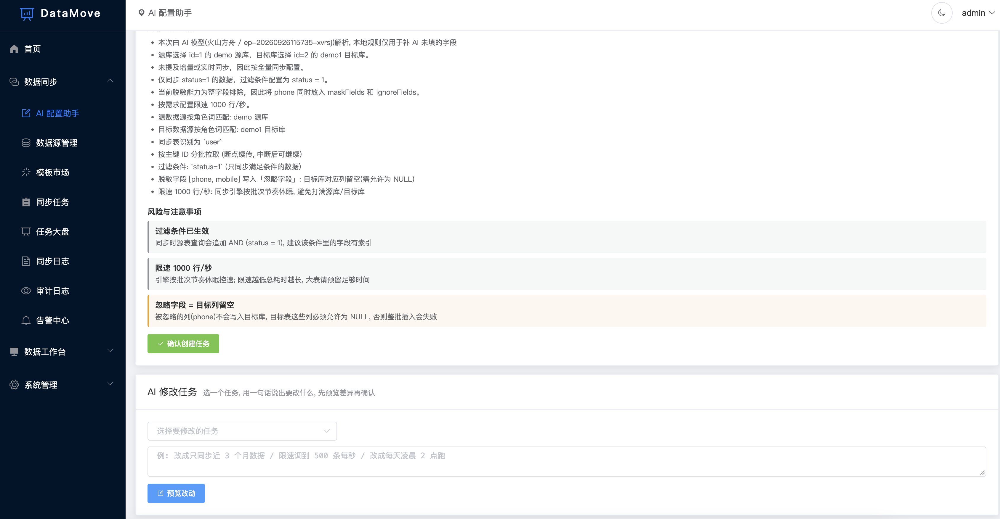
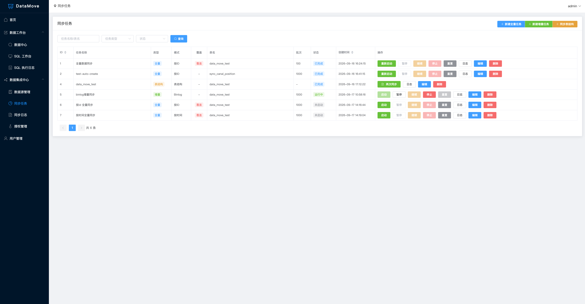
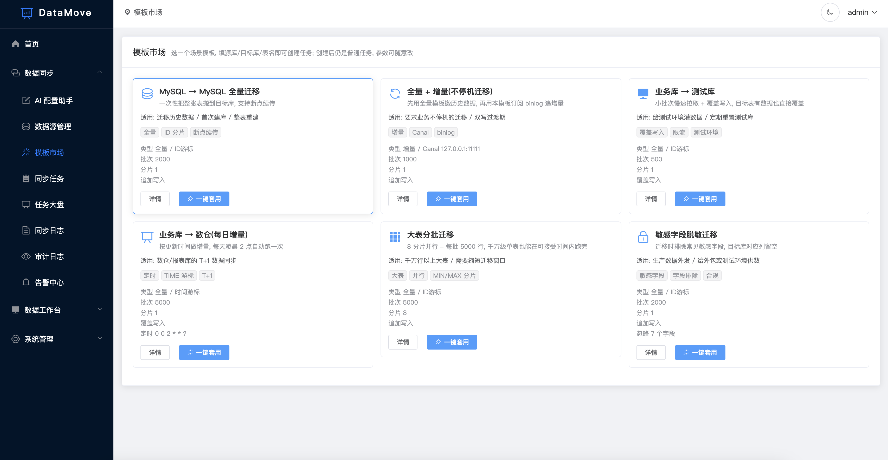
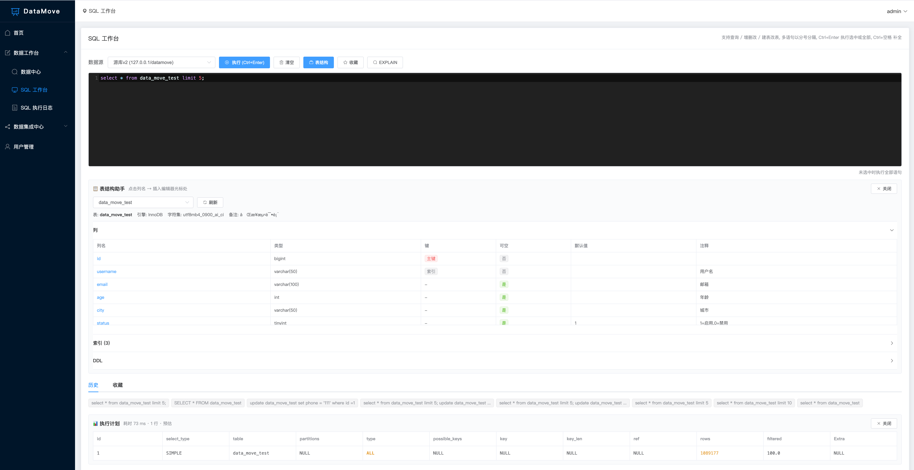
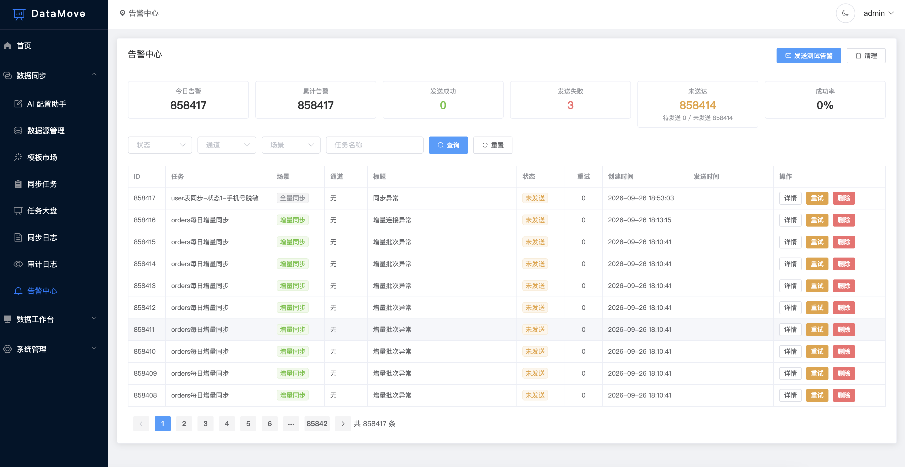
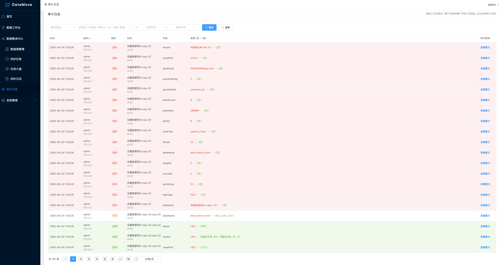
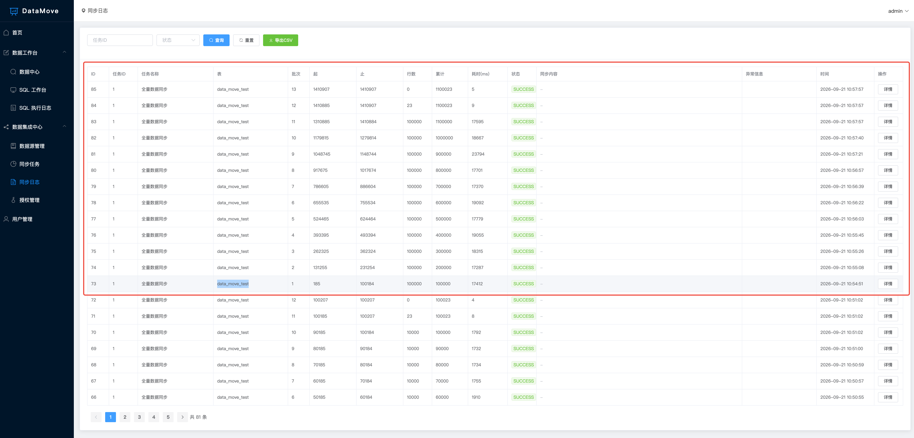

# 还在手写 DataX JSON？试试这个可视化同步工具

> 开源项目 **DataMove**，基于 RuoYi-Vue 4.8.1 前后端分离框架，SpringBoot 2.7 + MyBatis-Plus + Vue 2.7 + Element UI + Canal 1.1.7。
> 仓库：GitHub <https://github.com/qingtiandatamove/datamove> ｜ Gitee <https://gitee.com/qingtian2023/datamove>
>
> 发布须知：正文里的图片用的是仓库 `image/` 目录下的相对路径，掘金编辑器不认本地路径，发布时把对应截图手动粘贴/上传替换即可（`image/` 下已备好：首页、任务大盘、同步任务、字段映射、AI 配置助手、模版市场、告警中心、同步日志、审计日志、暗色主题、压测）。

## 先说痛点

做数据同步这事儿，大部分团队的现状是这样的：

1. **迁个库要写 JSON**。DataX 功能强，但一个同步任务就是一个几十上百行的 JSON，改个字段映射要找运维，还容易手抖写错列名。
2. **增量要自己写客户端**。Canal 订阅 binlog 很香，但消费端得自己撸：位点怎么存、重复事件怎么幂等、断开了怎么续、目标表怎么写，全是活。
3. **同步完不敢拍胸脯**。跑完了，谁也不知道目标库跟源库到底一不一样，只能 `select count(*)` 看个大概，对不上还得人工捞数据补。

DataMove 就是奔着这三个问题去的：**可视化零代码配置 + 断点续传幂等 + 同步完能定位到「哪一行哪个字段」对不上并一键修复**。

## 亮点一：AI 配置助手，一句话生成一个同步任务

这是最近刚上的功能，也是我觉得最省事的一个。

你不需要点任何下拉框，直接在输入框里写人话：

> 每天凌晨 2 点把 demo 库的 orders 表全量同步到 demo1 库，排除 password 字段

大模型直接返回一份**任务草稿**：源/目标数据源、同步表、同步模式、游标字段、批次大小、分片数、CRON、忽略字段、脱敏字段……全部填好。更关键的是它会**逐字段给出「为什么这么填」的解析依据**，外加风险提示（比如目标表不存在、没配主键这类），你确认无误再一键建任务。

已有任务也能用说话的方式改：

> 把同步时间改成每小时，分片改成 4

它会先给你**差异预览**（哪个字段 old → new），确认后才落库，不会闷头就把生产任务改了。

服务商随便换，DeepSeek / 通义千问 / 火山方舟 / 智谱 / 本地 Ollama 等任一 OpenAI 兼容服务都行，只填一个 `provider` 就自动套用预设地址。**没配 API Key 也不影响使用**——自动降级到本地规则解析，AI 是加速器，不是单点故障。




## 亮点二：四步向导建任务，字段映射能拖拽连线

不想打字也行，走「新建任务」向导：选源 → 选目标 → 选模式 → 字段映射，四步搞定。

- 同步方式做成卡片选，不用记参数含义
- 目标表不存在会提示先建表，不让任务跑一半才发现
- 字段映射支持**一键自动配对同名列**，也能 kettle 风格手动连线拖拽
- 批次 / 分片 / 告警这些高级参数默认收起，新手不被吓到

如果连向导都懒得走，还有**模板市场**：内置 6 个场景模板（全量迁移 / 全量+增量不停机 / 业务→测试 / 业务→数仓 T+1 / 大表并行 / 敏感字段排除），只填源库、目标库、表名，一键套用出任务。套出来的还是普通任务，参数随便改。






## 亮点三：全量 + 增量双模式，增量零侵入

- **全量**：按主键 ID 或时间字段分批拉取，`setFetchSize` 流式读取，内存里不驻留结果集
- **增量**：Canal 订阅源库 binlog ROW 模式，**不写源库、不加触发器**，对业务库无侵入
- **binlog 三层过滤**：服务端订阅收紧到「源库.任务表」，DML 类型按需勾选（归档库只收 INSERT），忽略字段让 INSERT/UPDATE 不写指定列——避免无关事件污染下游

## 亮点四：断点续传 + 幂等，重跑不脏数据

每批都是 `INSERT ... ON DUPLICATE KEY UPDATE`，**这一批写成功才推进断点**。任务中途挂了、手动停了、网络抖了，下次从断点接着跑，重复跑也不会产生脏数据。

## 亮点五：数据校验 + 一键修复（这个是我最想安利的）

同步完最怕的是「不知道对不对」。DataMove 用**源/目标双游标流式归并**做逐行比对：两边按主键排序各开一个游标，流式往前推，内存里只驻留一行，所以 100 万行也不会 OOM。

比对结果能定位到**具体哪一行、哪个字段**不一致，然后一键修复：

- 目标库缺的行 → 补 INSERT
- 字段值不一致 → 只 UPDATE 不一致的那几列
- **不删目标库任何数据**（这点很重要，修复只能"补"，不能"删"）

## 亮点六：分片并行，1000 万行从 31 分钟降到数分钟

FULL + ID 模式下可以按主键区间拆成多个分片并行跑。单线程实测 5,391 行/秒，线性外推 1000 万行要 31 分钟；开了分片并行后能压到数分钟量级。

## 亮点七：调度不只支持 CRON，还能被外部系统唤起

- **CRON 定时**：带可视化 Cron 生成器，秒/分/时/天/月/周分页签点选，不用背表达式
- **手动**：点一下就跑
- **事件触发**：给任务生成专属回调 URL，外部系统一个 `POST /sync/task/event/{token}` 就能拉起任务（令牌即密钥，免登录），任务还在跑时会自动跳过本次触发

## 亮点八：在线 SQL 工作台，写 SQL 不用再开 Navicat

任意数据源直接写 SQL 跑，多语句分号分隔。带 CodeMirror 语法高亮 + 关键字/表名/字段智能补全（Ctrl+空格唤起，输入 `.` 直出该表字段），旁边还能点列名一键插入编辑器。

跑之前可以先 EXPLAIN，**执行计划里的高危项会标色**（ALL 全表扫描、filesort、rows 过大），单语句 30s 超时防卡死，SQL 收藏 + 操作日志全程留痕。



## 亮点九：大盘、告警、审计，生产可用

- **实时监控大盘**：任务运行中展示速率、ETA、瓶颈库、分片实时状态，3s 自动刷新
- **钉钉告警**：同步失败 / Binlog 断开 / 数据源超时 / 行数不一致，自动推 Webhook
- **字段级审计日志**：谁、什么时候、改了哪个任务的哪个字段（old → new），同次请求多字段共享 revision_id 可一键回放，覆盖 7 种操作类型，操作人 + IP + UA 全留痕，旧值红色删除线 + 新值绿色追加——企业合规审计刚需
- **运行历史**：每次启动一条记录，结果/耗时/行数/速率/异常，支持趋势图 + CSV 导出
- **AES 密码加密**：数据源密码入库前加密，前端密文回显






## 实测数据

Docker 单实例 MySQL 8.0.41，`innodb_buffer_pool_size` 128MB，每事务刷盘，源库和目标库在**同一个实例**（所以这是单机上限，真实跨机还要扣掉网络 RTT）：

| 用例 | 行数 | batch_size | 总耗时 | 吞吐 | 单行耗时 |
| --- | --- | --- | --- | --- | --- |
| 10 万行 | 100,023 | 10,000 | **18.0 s** | 5,545 行/秒 | 0.180 ms |
| 100 万行 | 1,100,023 | 100,000 | **204.1 s** | 5,391 行/秒 | 0.186 ms |

结论：

1. **线性度好**：数据量放大 11 倍，单行耗时只涨 3.3%，吞吐掉 2.8%，流式读取确实生效，全程无 OOM、无 GC 抖动
2. **batch_size 不是越大越好**：1 万和 10 万吞吐只差 2.8%，瓶颈在单行写目标表（二级索引维护 + 每批 commit 刷盘），**推荐 1000 ~ 10000**，按「失败回滚代价」选
3. **零差异**：同步完逐行比对，两边均 1,100,023 行，字段不一致 0 行、目标库缺失 0 行



## 三步跑起来

```bash
# 1. 初始化数据库
mysql -uroot -p < sql/datamove.sql

# 2. 启动后端（JDK 1.8+ / Maven 3.6+）
mvn clean spring-boot:run

# 3. 启动前端
cd ruoyi-ui && npm install && npm run dev
```

打开 `http://localhost:80`，`admin / admin123` 登录（admin 首次登录会强制改密）。增量同步需要额外准备 Canal Server，README 第九章有详细步骤。

## 适合谁 / 不适合谁

**适合**：中小企业、外包团队、个人 Java 运维，需要经常在 MySQL 之间搬数据，又不想维护一堆 JSON 和命令行脚本的。

**不适合**：异构数据源同步（这版是 **MySQL 专属**，不是 MySQL→ES/Hive 那套）、超大规模实时数仓（那是 Flink / Kafka Connect 的地盘）。工具定位就是「把 MySQL 到 MySQL 这件事做得足够省事」。

## 最后

项目已开源，两个仓库同步更新：

- GitHub：<https://github.com/qingtiandatamove/datamove>
- Gitee：<https://gitee.com/qingtian2023/datamove>

- 文档齐全：README（完整功能 + 部署 + 高级用法）、GUIDE.md（新手页面地图 + 五步上手 + FAQ）、QUICKSTART.md（5 分钟跑起来）
- 效果图在 README 第十二章，16 张截图，含暗色主题
- 觉得有用的话点个 Star，有问题欢迎提 Issue，也欢迎 PR——尤其是新的迁移场景模板


