# DataMove 轻量 MySQL 数据同步工具

> 基于 **RuoYi-Vue 4.8.1 最新版** 前后端分离框架开发的 MySQL 专属数据同步工具

**GitHub**: <https://github.com/qingtiandatamove/datamove.git>

## 项目亮点

| 亮点 | 说明 |
| --- | --- |
| 零侵入增量同步 | 基于 Canal 订阅源库 binlog ROW 模式，**不写源库、不加触发器** |
| 可视化零代码 | 页面点点选选即可跑任务，替代 DataX / Canal 的命令行与 JSON |
| 四步新建向导 | 「新建任务」走 **选源 → 选目标 → 选模式 → 字段映射** 四步向导：同步方式做成卡片选，目标表缺失自动提示先建表，字段映射支持一键自动配对同名列，批次/分片/告警等高级参数默认收起 |
| 数据校验 + 一键修复 | 源/目标双游标流式归并，定位到行/字段差异，一键补 INSERT / 修 UPDATE（**不删目标库数据**） |
| 断点续传 + 幂等 | 每批 `INSERT ... ON DUPLICATE KEY UPDATE` 成功才推进断点，重跑不脏数据 |
| 全量 + 增量双模式 | 全量按主键 ID / 时间字段分批拉取，增量用 binlog 实时订阅 |
| 定时调度 + 事件触发 | 任务支持 **CRON 定时 / 手动 / 事件触发** 三选一调度：定时任务按表达式到点自动执行（可视化 Cron 生成器，秒/分/时/天/月/周分页签配置）；事件触发生成专属回调 URL，外部系统一个 `POST /sync/task/event/{token}` 即可拉起任务（令牌即密钥，免登录），任务运行中自动跳过本次触发 |
| 分片并行提速 | FULL+ID 模式按主键区间拆多线程并行，**1000 万行从 ~31 分钟降到数分钟** |
| binlog 事件过滤 | 服务端订阅收紧为「源库.任务表」，无关库表事件不进客户端；**DML 类型按需勾选**（如归档库只收 INSERT）；**忽略字段**让 INSERT/UPDATE 不写指定列 —— 三层过滤**避免无关事件污染下游** |
| 任务一键克隆 | 一键复制源任务的全部业务配置（数据源 / 同步模式 / 批次分片 / Canal / 字段映射），运行态字段（状态/起始位点/源表名）自动重置；任务名 `.copy` 后缀自动去重，并发克隆撞唯一索引时 UUID 短后缀兜底；克隆后弹窗顶部强提示"请修改表名+任务名后再启动"，避免表名沿用导致重复消费 binlog |
| 在线 SQL 工作台 | 任意数据源直接写 SQL 跑（多语句分号分隔），**CodeMirror 语法高亮 + 关键字/表名/字段智能补全**（Ctrl+空格手动唤起，输入自动联想，输入 `.` 直出该表字段）；**表结构助手**点列名即插入编辑器，**EXPLAIN 执行计划高危项标色提示**（ALL/index、filesort、大 rows）；**单语句 30s 超时**防卡死，支持 EXPLAIN（含 ANALYZE 二次确认）+ SQL 收藏 + 操作日志全程留痕 |
| 实时监控大盘 | 任务运行中展示速率、ETA、瓶颈库、分片实时状态，3s 自动刷新 |
| 钉钉告警 | 同步失败 / Binlog 断开 / 数据源超时 / 行数不一致，自动推送 Webhook |
| 字段级审计日志 | **谁 / 什么时候 / 改了哪个任务的哪个字段 (old → new)**，**同次请求多字段共享 revision_id** 可一键回放本次修改；覆盖 CREATE / DELETE / UPDATE / START / PAUSE / RESUME / STOP 7 种操作类型；操作人 + IP + 客户端 UA 全留痕；支持按操作类型 / 关键字（任务名 / 字段名 / 操作人 / IP / 旧值 / 新值）/ 时间范围多维筛选；旧值红色删除线 + 新值绿色追加，**企业合规审计必备** |
| 运行历史留痕 | 每次启动一条记录，结果/耗时/行数/速率/异常，支持趋势图 + CSV 导出 |
| RBAC 权限体系 | 继承 RuoYi 完整用户/角色/菜单，admin 强制首次改密 |
| AES 密码加密 | 数据源密码入库前 AES 加密，前端密文回显（前 2 位 + **** + 后 2 位） |
| 轻量部署 | Spring Boot 单体 + Vue 2，单实例即可承接亿级行同步 |

## 文档目录

| 文档 | 适合谁 |
|---|---|
| [GUIDE.md](GUIDE.md) | **新手操作人员, 第一次用不知道点哪里** — 页面地图 + 五步上手 + 场景手册 + 名词表 + FAQ |
| [QUICKSTART.md](QUICKSTART.md) | **第一次接触, 想 5 分钟跑起来** — 含同类工具对比表 + 不适用场景 |
| [LICENSING.md](LICENSING.md) | 想了解"哪些代码开源 / 哪些是商业付费 / 当前 LicenseService 怎么配"的人 |
| 本 README | 完整功能说明 + 部署 + 高级用法 |


## 一、产品定位

- 面向中小企业 / 外包团队 / 个人 Java 运维的可视化、零代码 MySQL 数据同步工具
- 替代 DataX / Canal 复杂命令行配置
- 支持 **断点续传 + 钉钉告警 + 幂等同步**
- 自带 **数据校验(差异对账) + 一键修复**: 同步完能定位到「哪一行、哪个字段」对不上, 并一键补齐

## 二、技术栈

| 层级 | 技术 |
|------|------|
| 后端 | SpringBoot 2.7.18 + MyBatis-Plus 3.5.5 + Spring Security + JWT |
| 前端 | Vue 2.7 + Element UI 2.13 (RuoYi-Vue) |
| 持久层 | MyBatis-Plus 3.5 |
| 同步 | 原生 JDBC 分批 + Canal Client 1.1.7 增量 |
| 校验 | 源/目标双游标流式归并比对 (`setFetchSize` 流式读取, 内存里只驻留一行) |
| 修复 | 按差异明细回放 INSERT(补缺失) / UPDATE(只改不一致的列), 不删目标库多余行 |
| 加密 | AES 对称加密 (BC) |
| 调度 | ThreadPoolTaskScheduler (CRON 定时) + HTTP 事件回调 |
| 告警 | 钉钉 Webhook |
| 数据库 | MySQL 8.0 |

## 三、整体架构

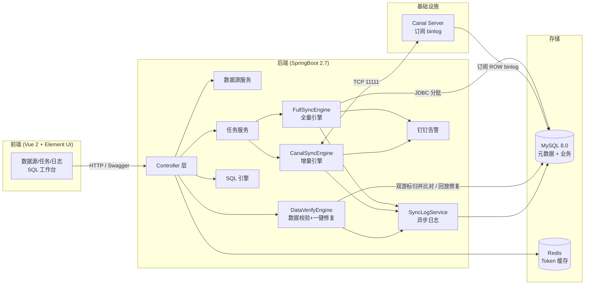

前端只做展示与配置，同步动作全部落在后端引擎：全量走原生 JDBC 分批拉取，增量走 Canal Client 订阅 binlog，两者共用异步日志与钉钉告警。
数据校验是同步之外的**旁路只读体检**：源库与目标库各开一个流式游标做双指针归并，结果与差异明细落在自己的两张表里，既不占用同步线程，也不改写任务状态。

## 四、目录结构

```
datamove/
├── pom.xml                       # 后端依赖
├── sql/datamove.sql              # 数据库初始化脚本
├── src/main/java/com/ruoyi/datamove/
│   ├── DatamoveApplication.java  # SpringBoot 启动类
│   ├── auth/                     # 登录 & 用户认证
│   ├── datasource/               # 数据源管理 (需求 3.1)
│   ├── task/                     # 同步任务管理 (需求 3.2)
│   ├── audit/                    # 审计日志 (字段级变更追踪, 需求 3.7)
│   ├── engine/                   # 同步核心引擎
│   │   ├── full/                 #   - 全量同步 (ID+Time 双模式+断点续传+幂等)
│   │   ├── incr/                 #   - Canal 增量同步
│   │   ├── verify/               #   - 数据校验(差异对账 + 一键修复)
│   │   └── log/                  #   - 异步日志
│   ├── log/                      # 日志 Controller(列表/统计/导出 CSV/清理)
│   └── common/                   # 全局异常处理
├── src/main/resources/
│   ├── application.yml
│   └── application-dev.yml
└── ruoyi-ui/                     # 前端(Vue 2 + Element UI)
    ├── vue.config.js
    └── src/
        ├── api/                  # 接口封装
        ├── views/sync/           # 数据源/任务/日志
        └── views/system/         # 用户管理
```

## 五、核心模块说明

### 5.1 数据源管理 - 对应文档 3.1
- 增 / 删 / 改 / 查
- **测试连接**:实时校验数据库连通性 + 账号权限
- 数据库密码 AES 加密,前端密文 (前 2 位 + **** + 后 2 位) 回显
- 删除前检查是否被任务引用

### 5.2 同步任务管理 - 对应文档 3.2
- **新建任务向导**(默认入口, 面向不熟悉系统的操作人员): 四步搞定 ——
  - **① 选源**: 源数据源 + 同步表名, 选完即时回显"读到 N 个字段"(读不到 = 库连不上)
  - **② 选目标**: 目标数据源 (屏蔽源库, 同库同名无意义) + 自动探测目标库是否有同名表, 缺失即提示先跑一次「同步表结构」
  - **③ 选模式**: 任务类型卡片(全量/增量/DDL)+ 追数方式 + 调度方式, 每步都有人话说明; 任务名留空自动生成;
    批次 / 分片 / 覆盖 / 忽略字段 / 告警收进折叠的「高级设置」
  - **④ 字段映射**: 复用 kettle 风格拖拽连线, 新增「自动配对同名字段」; 不连线 = 同名全同步
  - 校验按步走, 出错只卡在当前步并给原因; 创建完成后询问是否立即启动
  - 熟悉参数的用户仍可点「高级表单」直接面对完整表单 (与编辑任务同一套)
- 支持两种任务类型: **全量 (FULL) / 增量 (INCR-Binlog)**
- **调度方式三选一** (`sync_task.trigger_type`):
  - **手动 (MANUAL)**: 界面点「启动」才执行 (默认)
  - **定时 (CRON)**: 按表达式到点自动启动, 与手动启动完全等价; 任务运行中跳过本次, 下个周期再触发;
    表达式可从常用频率下拉选择, 或用**可视化 Cron 生成器**(秒/分/时/天/月/周分页签, 周期/间隔/具体值自由组合)生成;
    保存即生效无需再点启动, 改配置自动重注册, 服务重启自动重装载
  - **事件触发 (EVENT)**: 保存后自动生成触发令牌, 外部系统 `POST /sync/task/event/{token}` 免登录拉起任务;
    令牌即密钥, 克隆/导入的任务重新生成新令牌
- 全量同步两种模式:
  - **按主键 ID** (`WHERE id > #{lastId} ORDER BY id ASC LIMIT #{batchSize}`)
  - **按时间字段** (`WHERE time > #{lastTime} OR (time = #{lastTime} AND id > #{lastIdInBatch}) ORDER BY time ASC, id ASC LIMIT ...`)
- **断点续传**:整批 `INSERT ... ON DUPLICATE KEY UPDATE` 成功后才更新断点
- **幂等防重**:任务重跑不产生脏数据
- 任务操作:启动 / 暂停 / 继续 / 终止 / 重置进度 / 查看日志 / **清理日志**
- **日志清理**:行内「清日志」一键清空该任务日志; 顶部「日志清理」可按 任务 / 状态 / 保留天数 批量清理,
  也可勾选「清空全部」(需二次确认); 清理前后端都返回实际删除条数, 任务配置与断点进度不受影响
- **单实例保护**:同一任务只能有一个 worker 在跑
- **任务大盘** (`/sync/dashboard`):实时展示每个任务的 **行/秒**(10s 滑动窗口)、
  **ETA**(按源表总行数估算)、**当前批次**、**瓶颈库**(源库读取 对比 目标库写入耗时)、
  进度与总吞吐; 分片任务额外展示每个分片的**区间、游标、实时速率、状态**, 有任务运行时 3s 自动刷新
- **运行历史**(大盘「运行历史」区块, 表 `sync_task_run`):实时监控看现在, 运行历史看过去——
  每次「启动」任务写一条记录, 全量 / 增量 / 表结构任务都适用
  - 概览卡: 运行次数 / 成功 / 失败 / 运行中 / 同步行数 / 失败行数 / 平均耗时 / 平均速率(按当前筛选条件实时统计)
  - 近 7 / 14 / 30 天趋势图: 柱 = 运行次数(成功、失败堆叠), 线 = 同步行数
  - 多维筛选: 任务、表名、类型、结果、时间范围, 以及**关键字**(表名 / 源库 / 目标库 / 模式 / 异常信息)
  - 表格: 结果、开始 / 结束时间、耗时、成功 / 失败行数、平均速率(行/秒)、批次数、分片数、异常;
    失败行与运行中行高亮, 双击或点「详情」查看完整记录(可一键复制), 支持 **CSV 导出**(与筛选条件口径一致)
  - 运行中每 5s 回填一次进度(服务重启也能看到跑到哪), 结束后回填最终结果;
    完成 / 失败 / 停止 / 暂停都会各自收口一条历史, 不会留下「悬挂的运行中」
  - 「清理」支持按当前筛选条件清理, 或只保留最近 N 天(运行中的记录不会被清理); 删除任务时其运行历史一并删除
- **全部任务表格**还展示每个任务的 **运行次数**(可点击直接筛出该任务的运行历史)与
  **最近运行**(结果 / 时间 / 同步行数 / 耗时), 一眼看出哪些任务最近跑挂了
- **分片并行同步**(大数据提速):FULL+ID 模式配置 `shard_count > 1` 时按 `MIN/MAX(主键)` 均分区间,
  每分片独立线程与连接并行读写, 吞吐近线性提升(1000 万行从约 31 分钟缩到数分钟);
  断点续传任务自动回退单线程, 暂停后重跑幂等无脏数据
- **binlog 事件过滤**(增量任务):按 **库/表/DML 类型** 三层过滤增量事件, 避免无关事件污染下游——
  - **库/表过滤**(自动, 零配置):Canal 服务端订阅表达式从 `.*\..*` 收紧为「源库.任务表」,
    其他库表的事件**根本不进客户端**, 减少网络传输与解析开销
    (源库缺失时自动退化为全量订阅老行为, 客户端仍有兜底过滤)
  - **DML 类型过滤**(可选, 任务表单勾选):只同步勾选的 INSERT / UPDATE / DELETE,
    未勾选的事件直接丢弃不写目标库——典型场景: 归档库只同步 INSERT、
    审计库不要 DELETE; 不勾 = 全部(老任务零感知)
- **binlog 忽略字段**(增量 + 全量任务):任务表单「校验忽略字段」一栏填列名,
  binlog 解析的 INSERT/UPDATE SQL 在拼装时**自动剔除**这些列, 目标库保持原值不变——
  - 典型场景: 目标库自带 `create_time` / `update_by` / `tenant_id` 等列, 不能被源库覆盖;
    或者某些 `text` / `json` 大字段根本不参与同步
  - **key 列永远保留**, 即使填了主键也会被忽略器跳过——保证 UPDATE/DELETE 仍能用关键行定位目标
  - 列名匹配**字段映射后**的目标列名, 所以配了「字段映射」时也无需改这里
  - 同时被「数据校验」读取: 校验时这些列差异被忽略, 不会出现「假差异」
  - 留空 = 不过滤 (老任务零感知)

#### 批次 (batch_size) 与分片 (shard_count) 的区别

两者是不同维度的概念, **组合关系而非替代关系**——每个分片线程内部照样按批次拉取写入:

| 维度 | 批次 (batch_size) | 分片 (shard_count) |
|------|-------------------|--------------------|
| 切分方向 | **时间维度**"分次" | **空间维度**"分区" |
| 工作方式 | 单线程内按 `LIMIT batchSize` 游标循环, 一批写完 commit 再读下一批 | 整表按主键区间均分成 N 块, N 个线程**同时**各管一块 |
| 目的 | 控制**内存**(不一次加载百万行)、缩短事务(避免长事务锁 binlog)、失败只重试一小批 | 提升**并行吞吐**(N 个独立源/目标连接读写并行, 耗时近线性 /N) |
| 特点 | 串行, 同一时刻 1 读 1 写 | 区间互不重叠, 线程互不干扰 |

```
串行 (shard_count=1):
  线程1: [批次1]→[批次2]→[批次3]→...→[批次N]        总时间 T

分片并行 (shard_count=4):
  线程1: [批次1]→[批次5]→...   ┐
  线程2: [批次2]→[批次6]→...   ├─ 同时进行           总时间 ≈ T/4
  线程3: [批次3]→[批次7]→...   ┘
  线程4: [批次4]→[批次8]→...
```

**调参建议**:

| 配置 | 字段 | 建议 |
|------|------|------|
| 批次大小 | `batch_size` | 1000~10000, 太大占内存、太小批次开销大 (见第十一章压测结论) |
| 分片数 | `shard_count` | 1~16, 参考目标库写入能力, 分片越多对目标库写入压力越大 |

### 5.3 同步日志 - 对应文档 3.3
- 任务总进度 / 单批次明细日志 / 异常错误日志 (批次号、分片号、同步模式、位点起止、行数、累计行数、单批耗时、行/秒)
- 顶部概览卡: 按当前筛选条件实时统计 日志条数 / 成功 / 失败 / 同步行数 / 平均单批耗时 / 含异常信息
- 多维筛选: 任务 ID、任务名称、表名、状态、分片号、批次号、时间范围, 以及**关键字全文检索**
  (任务名 / 表名 / 位点 / 同步内容 / 异常信息 / 同步模式)
- 快捷筛选 (全部 / 只看失败 / 含异常信息 / 运行中)、失败行高亮、双击查看批次详情 (可一键复制)
- 可选自动刷新 (有运行中日志时 5s)、CSV 导出 (与页面筛选条件口径一致)

### 5.4 钉钉告警 - 对应文档 3.4
- 全量任务运行失败 / 中断终止
- 增量 Binlog 断开 / 监听异常
- 数据源连接超时 / 失败
- 行数不一致

### 5.5 数据校验与一键修复 - 对应文档 3.5
- 入口:任务列表行内「数据校验」→ 抽屉。打开先展示**最近一次**结果(多数时候只是想看上次差异),要重跑再点「开始校验」
- **对账算法**:源/目标各开一个流式游标(`setFetchSize(Integer.MIN_VALUE)`,内存里始终只驻留一行),
  按主键升序**双指针归并**比对:
  - 源主键 < 目标主键 → 源有目标无 = `MISSING`(缺失,补 INSERT)
  - 源主键 > 目标主键 → 目标有源无 = `EXTRA`(目标脏数据,**只报告不删**)
  - 两边主键相等 → 比字段值,不同 = `MISMATCH`(不一致,只更新不一致的列)
  相比「两边各 `count(*)` 比总数」,归并能定位到具体哪一行、哪个字段,这才是"一键修复"的前提;
  相比「分段 checksum」,它不用额外建索引、不用全表排序,且天然支持断点式进度上报
- **进度可见**:已比对行数 / 源扫描行数 / 目标扫描行数与三类差异数每 5000 行回填一次,抽屉内 2s 轮询展示;
  每 5 万行写一条同步日志,可随时「中止校验」
- **差异明细**:按类型(缺失 / 不一致 / 多余)筛选 + 分页查看主键、字段差异与修复状态;
  差异超过 2000 条时只保留前 2000 条明细(`truncated=1` 会明确提示"仅保留前 N 条"),**但统计数字始终是全量准确的**
- **一键同步差异**:补缺失(INSERT 缺失行)+ 修不一致(只 UPDATE 差异列),每批 200 条落库并逐条回填
  修复状态(已修复 / 失败 / 跳过),修复过程可「中止修复」
  - **不会删除目标库任何数据**:多余行只在明细里标出来 —— 删除是破坏性动作,不藏在按钮背后
- **忽略字段**(`sync_task.ignore_fields`):`update_time`、`ON UPDATE CURRENT_TIMESTAMP` 这类由数据库自动维护的列
  天然与源库不同,不配忽略会刷出满屏假差异
- **只读旁路**:校验与修复都**不改 `sync_task.status`**,避免出现「任务已完成却显示运行中」的状态错乱;
  表结构(DDL)任务没有数据可比对,会直接提示,不会静默失败
- **单实例保护**:同一任务同时只允许一个校验在跑
- **接口**:`POST /sync/verify/start/{taskId}` 启动(只返回 `verifyId`,全表比对可能很慢,进度由前端轮询);
  `GET /sync/verify/{verifyId}` 进度、`/{verifyId}/summary` 汇总、`/{verifyId}/diffs` 明细、
  `GET /sync/verify/latest/{taskId}` 最近一次、`POST /{verifyId}/repair` 一键同步差异、
  `POST /{verifyId}/stop` 中止校验、`POST /{verifyId}/repair/stop` 中止修复
- 校验运行记录与差异明细都留痕(表 `sync_task_verify` / `sync_task_diff`),
  任务名与源/目标库名都做了快照,任务改名后历史依然读得懂

### 5.6 用户权限 - 对应文档 3.6
- **超级管理员 (admin)**:所有权限
- **普通操作员 (operator)**:仅查看任务、启停任务、查看日志
- 超级管理员账号内置,启动时强制首次修改密码

### 5.7 审计日志 - 对应文档 3.7
- **谁在什么时候改了哪个任务的哪个字段**: 企业合规审计必备, 字段级粒度 (不是只记一条"任务被修改过")
- **抓取点**: 仅 `sync_task` 的新增 / 修改 / 删除(软删); 启动 / 暂停 / 继续 / 终止 / 重置等运行时操作不进审计 (它们属于"行为", 在 `sync_task_run` 已有运行历史)
- **同次请求分组**: 一次修改任务的多个字段共享一个 `revision_id`, 详情页一键还原"同一时刻发生了什么"
- **字段快照**: `entity_name`(任务名) / `operator_name`(操作人) 都是**写库那一刻的快照**, 任务改名/操作员改名后历史依然读得懂
- **上下文**: 同时记录 **IP** + **客户端 UA**, 方便定位"是哪个终端 / 谁登录之后改的"
- **写入是旁路**: 审计日志写库失败只 warn, **绝不会**搞挂主流程 —— 审计是合规可选项, 不能反过来影响业务
- **筛选**: 操作类型 / 关键字(任务名·字段名·操作人·旧值·新值·IP) / 时间范围; 按 id 或 create_time 排序
- **UI**: 顶部「数据集成中心」→「审计日志」(admin 独占), 行底色按操作类型区分(新增淡绿 / 删除淡红), 旧值红色删除线、新值绿色高亮, 「查看整次」一键展开同 `revision_id` 的全部字段变更
- **接口**: `GET /sync/audit/page` 分页 + `GET /sync/audit/revision/{revisionId}` 同次请求详情
- **存储**: 表 `sync_audit_log`(升级脚本 `upgrade_20260923_audit_log.sql`)
- **后续扩展**: `entity_type` 字段已预留, 未来要审计数据源 (`sync_datasource`) 修改时, 加一个 `recordDatasourceXxx(...)` 方法即可, 表结构不用动

## 六、数据库表结构 - 对应文档 4

| 表 | 说明 |
|----|------|
| `sync_datasource` | 数据源配置 (密码 AES 加密) |
| `sync_task` | 同步任务主表 (含 `binlog_dml_types` 增量 DML 过滤配置) |
| `sync_task_progress` | **断点进度核心表** |
| `sync_task_log` | 同步日志 (含批次明细) |
| `sync_task_run` | **运行历史核心表** (每次启动一条: 结果 / 耗时 / 行数 / 速率 / 异常) |
| `sync_task_verify` | **数据校验运行记录** (每次校验一条: 进度 / 缺失·不一致·多余 统计 / 修复结果) |
| `sync_task_diff` | 数据校验差异明细 (差异类型 / 主键 / 字段差异 / 修复状态), 「一键同步差异」的依据 |
| `sync_audit_log` | **审计日志核心表** (字段级变更: 谁/什么时候/改了哪个任务的哪个字段 old→new, 企业合规审计) |
| `sync_canal_position` | Canal 增量监听位点 |
| `sys_user / sys_role / sys_user_role / sys_menu / sys_role_menu` | RuoYi 框架权限 |

## 七、快速启动

### 1. 准备环境
- JDK 1.8+
- Maven 3.6+
- MySQL 5.7 / 8.x
- (可选)Canal Server 用于增量同步

### 2. 初始化数据库
```bash
mysql -uroot -p < sql/datamove.sql
```

> 初始化脚本已包含下面全部升级项的结构变更, **全新环境到此为止**, 不必再执行升级脚本。

老库升级(仅限"已经初始化过的老库", 脚本幂等, 按日期顺序执行):
```bash
mysql -uroot -p datamove < sql/upgrade_20260921_alert_email.sql
mysql -uroot -p datamove < sql/upgrade_20260921_field_mapping.sql
mysql -uroot -p datamove < sql/upgrade_20260921_sql_favorite.sql
mysql -uroot -p datamove < sql/upgrade_20260922_shard_count.sql
mysql -uroot -p datamove < sql/upgrade_20260922_shard_no.sql
mysql -uroot -p datamove < sql/upgrade_20260922_task_run.sql
mysql -uroot -p datamove < sql/upgrade_20260922_data_verify.sql
mysql -uroot -p datamove < sql/upgrade_20260923_audit_log.sql
mysql -uroot -p datamove < sql/upgrade_20260923_binlog_filter.sql
mysql -uroot -p datamove < sql/upgrade_20260925_trigger_type.sql
```

### 3. 启动后端
```bash
mvn clean spring-boot:run
# 或打包: mvn package -DskipTests
```

启动成功后访问:
- 后端 API: `http://localhost:8080/`
- Swagger 文档: `http://localhost:8080/swagger-ui/index.html`

### 4. 启动前端
```bash
cd ruoyi-ui
npm install
npm run dev
```
打开 `http://localhost:80`,使用 `admin / admin123` 登录

### 5. 默认账号

| 账号 | 密码 | 角色 |
|------|------|------|
| admin | admin123 | 超级管理员 |

## 八、数据库初始化值


第一次登录后请立即:
1. 修改默认密码
2. 添加需要同步的源库 / 目标库
3. 创建第一个同步任务

## 九、增量同步前置准备 (Canal)

仅全量可跳过。启用增量前:
```sql
-- 1. 源库开启 binlog ROW 模式
SET GLOBAL binlog_format = 'ROW';


-- 3. Canal Server 部署参考官方文档
--    下载地址: https://github.com/alibaba/canal/releases
```

在 Canal 配置文件中指向源库,然后在 DataMove 创建增量任务时填写:
- Canal Host
- Canal Port (默认 11111)
- Canal Destination (canal 配置文件中 instance 名)

## 十、二期预留(本次未实现)

- DDL 表结构同步
- 数据脱敏
- SaaS 多租户网页版
- PostgreSQL / Oracle 支持

---

## 十一、性能实测：10 万 / 100 万行全量同步

> 下列数字全部取自 `sync_task_log`（批次明细）与 `sync_task_progress`（断点记录）的真实落库数据，未做估算或美化。

### 11.1 测试环境

| 项 | 值 |
| --- | --- |
| MySQL | 8.0.41（Docker 单实例） |
| `innodb_buffer_pool_size` | 128 MB |
| `innodb_flush_log_at_trx_commit` | 1（每事务刷盘） |
| 源库 | `datamove` @ 127.0.0.1:3306（数据源「源库v2」） |
| 目标库 | `sys` @ 127.0.0.1:3306（数据源「目标库」） |
| 任务 | #1「全量数据同步」· FULL · ID 模式 · `overwrite_flag=1` |
| 测试表 | `data_move_test`，12 个字段 + 2 个二级索引，110 万行约 363 MB |
| 造数方式 | `INSERT ... SELECT` 数字表笛卡尔积，10 万 / 100 万各一批 |

> 源库与目标库是**同一个 MySQL 实例**，读和写在同一个 buffer pool 里循环，因此这是一组「单机上限」数据，真实跨机同步还要再扣掉网络 RTT 与带宽开销。

### 11.2 同步总耗时

两次均为 `overwrite_flag=1` 的覆盖式全量：先 `TRUNCATE` 目标表、清空断点，再从 `id > 0` 重新拉一遍全表。

| 用例 | 源表行数 | `batch_size` | 批次数 | **同步总耗时** | 吞吐 | 单行耗时 | 失败批次 |
| --- | --- | --- | --- | --- | --- | --- | --- |
| A：10 万行 | 100,023 | 10,000 | 12 | **18.0 s** | 5,545 行/秒 | 0.180 ms | 0 |
| B：100 万行 | 1,100,023 | 100,000 | 13 | **204.1 s** | 5,391 行/秒 | 0.186 ms | 0 |

- 总耗时口径：Σ 单批 `cost_ms`（首批开始取数 → 最后一批写入完成），与日志首末时间戳的墙钟差一致，说明批次之间没有空转。
- 用例 A 起止 `10:50:46 → 10:51:02`；用例 B 起止 `10:54:33 → 10:57:57`。
- 12 / 13 批中的最后两批是收尾：先取到剩余 23 行，再取一次空集确认到底，`while` 循环才退出。

### 11.3 批次明细

<details>
<summary><b>用例 A：10 万行（batch_size = 10,000，总耗时 18.0 s）</b></summary>

| 批次 | 日志区间 | 本批行数 | 累计 | 耗时 |
| --- | --- | --- | --- | --- |
| 1 | 185 → 10,184 | 10,000 | 10,000 | 1,993 ms |
| 2 | 10,185 → 20,184 | 10,000 | 20,000 | 1,808 ms |
| 3 | 20,185 → 30,184 | 10,000 | 30,000 | 1,683 ms |
| 4 | 30,185 → 40,184 | 10,000 | 40,000 | 1,806 ms |
| 5 | 40,185 → 50,184 | 10,000 | 50,000 | 1,813 ms |
| 6 | 50,185 → 60,184 | 10,000 | 60,000 | 1,910 ms |
| 7 | 60,185 → 70,184 | 10,000 | 70,000 | 1,755 ms |
| 8 | 70,185 → 80,184 | 10,000 | 80,000 | 1,734 ms |
| 9 | 80,185 → 90,184 | 10,000 | 90,000 | 1,732 ms |
| 10 | 90,185 → 100,184 | 10,000 | 100,000 | 1,792 ms |
| 11 | 100,185 → 100,207 | 23 | 100,023 | 8 ms |
| 12 | 100,207 → 100,207 | 0 | 100,023 | 4 ms |
| **合计** | **12 批** | **100,023** | — | **18,038 ms ≈ 18.0 s** |

</details>

<details>
<summary><b>用例 B：100 万行（batch_size = 100,000，总耗时 204.1 s）</b></summary>

| 批次 | 日志区间 | 本批行数 | 累计 | 耗时 |
| --- | --- | --- | --- | --- |
| 1 | 185 → 100,184 | 100,000 | 100,000 | 17,412 ms |
| 2 | 131,255 → 231,254 | 100,000 | 200,000 | 17,287 ms |
| 3 | 262,325 → 362,324 | 100,000 | 300,000 | 18,315 ms |
| 4 | 393,395 → 493,394 | 100,000 | 400,000 | 19,055 ms |
| 5 | 524,465 → 624,464 | 100,000 | 500,000 | 17,779 ms |
| 6 | 655,535 → 755,534 | 100,000 | 600,000 | 19,092 ms |
| 7 | 786,605 → 886,604 | 100,000 | 700,000 | 17,370 ms |
| 8 | 917,675 → 1,017,674 | 100,000 | 800,000 | 17,701 ms |
| 9 | 1,048,745 → 1,148,744 | 100,000 | 900,000 | **23,794 ms** |
| 10 | 1,179,815 → 1,279,814 | 100,000 | 1,000,000 | 18,667 ms |
| 11 | 1,310,885 → 1,410,884 | 100,000 | 1,100,000 | 17,595 ms |
| 12 | 1,410,885 → 1,410,907 | 23 | 1,100,023 | 9 ms |
| 13 | 1,410,907 → 1,410,907 | 0 | 1,100,023 | 5 ms |
| **合计** | **13 批** | **1,100,023** | — | **204,081 ms ≈ 204.1 s** |

</details>

### 11.4 结论

1. **线性度好，100 万行量级没有劣化**：数据量放大 11 倍，单行耗时只从 0.180 ms 涨到 0.186 ms（+3.3%），吞吐仅下降 2.8%。说明 `setFetchSize(batchSize)` 的流式读取确实生效——内存占用未随数据量膨胀，全程无 OOM、无 GC 抖动。
2. **`batch_size` 从 1 万放大到 10 万，吞吐几乎没变**：两次用例 `batch_size` 差 10 倍，吞吐只差 2.8%（且更大的批次略慢）。瓶颈**不在**网络往返 / 事务提交次数，而在单行写目标表（2 个二级索引维护 + 每批 `commit` 刷盘）。因此 `batch_size` 应按「失败回滚代价」来选，**推荐 1,000 ~ 10,000**。
3. **单批耗时存在 ~30% 的离群点**：用例 B 第 9 批 23,794 ms，比中位数 18,315 ms 高 30%，属 InnoDB checkpoint 刷脏页 + 二级索引页分裂造成的周期性写放大抖动，不是引擎逻辑问题。
4. **同步结果零差异**：同步结束后逐行比对源库与目标库，两边均 1,100,023 行，`username` / `phone` / `city` 字段不一致 0 行、目标库缺失 0 行。
5. **线性外推：1000 万行约 31 分钟**：按 5,391 行/秒，1000 万行单线程需要约 1,855 秒，这正是 Roadmap 中「按主键区间分片并行」的价值所在。

---

## 十二、效果图

### 首页

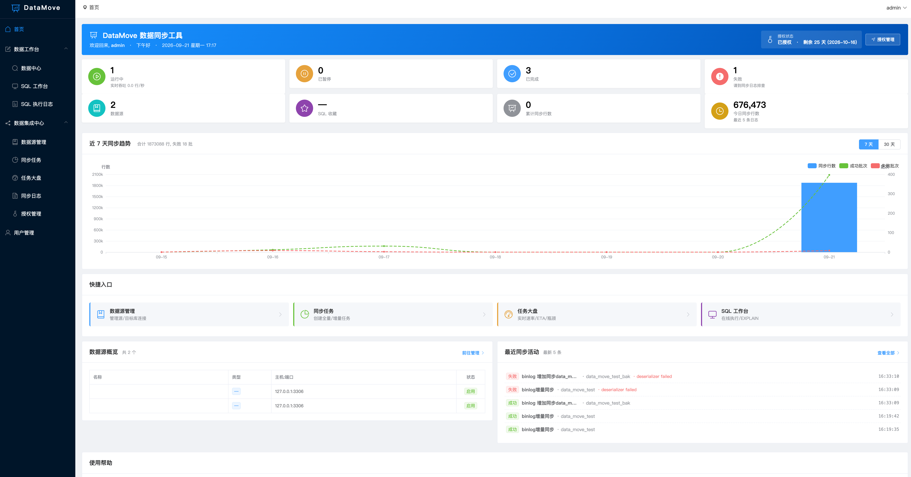

### SQL 工作台

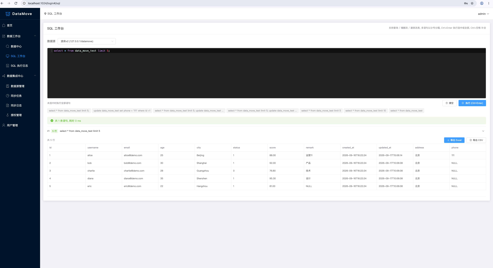

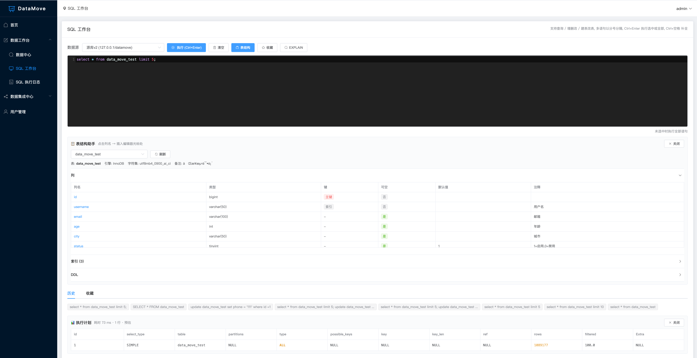

### 任务大盘

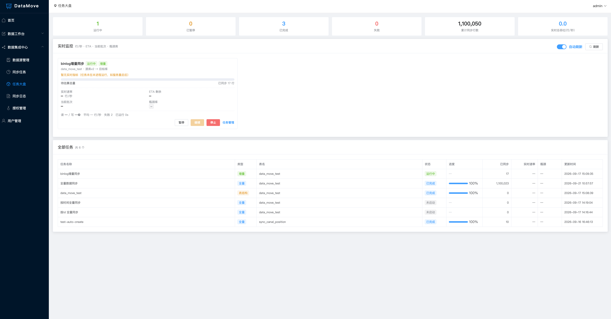

### 同步任务

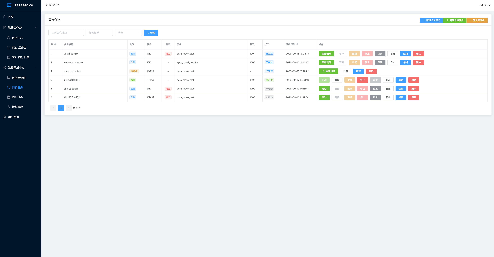

### 字段映射 (kettle 风格连线拖拽)

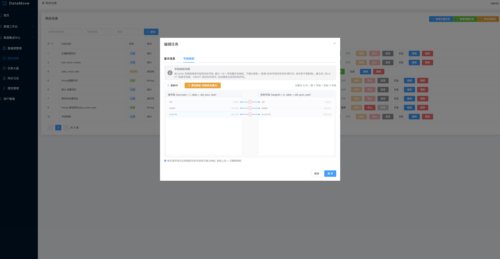

### 同步日志

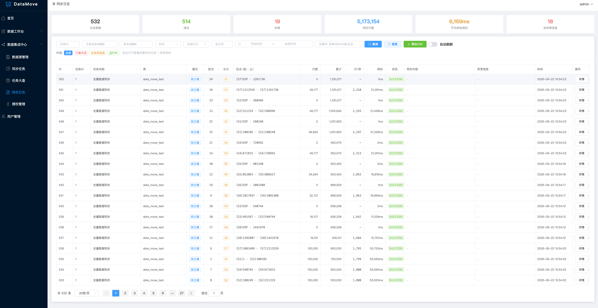

### 审计日志

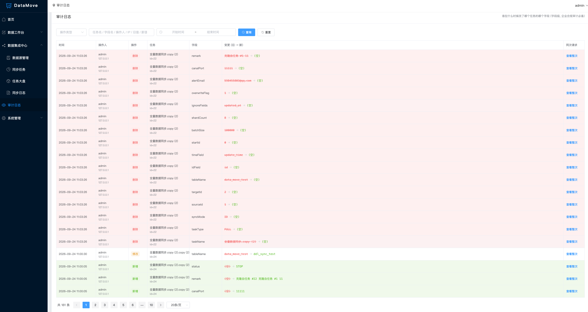

## 十三、压测效果图

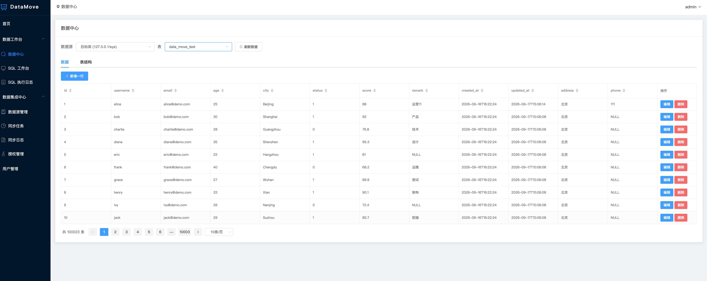

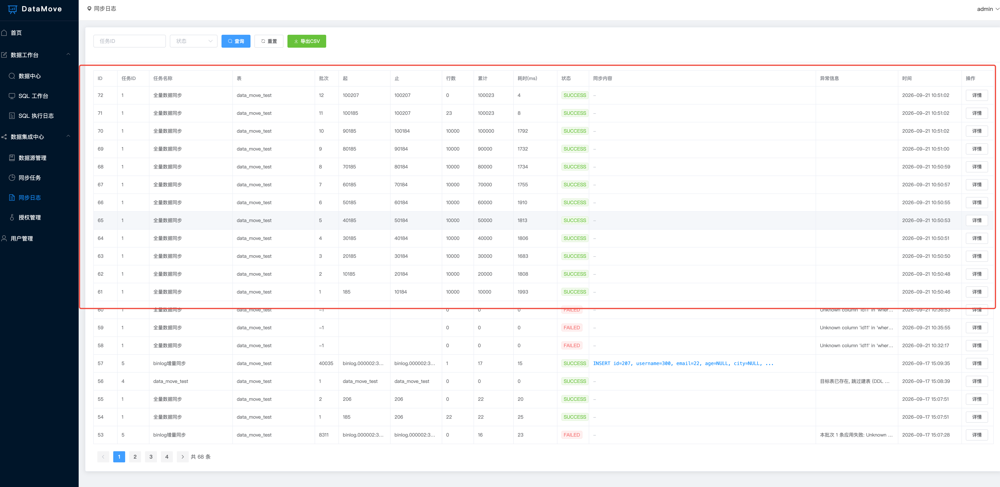

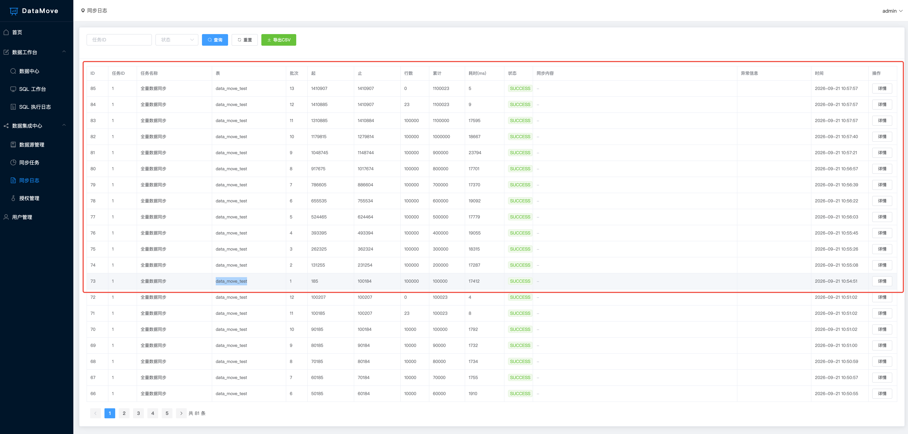

