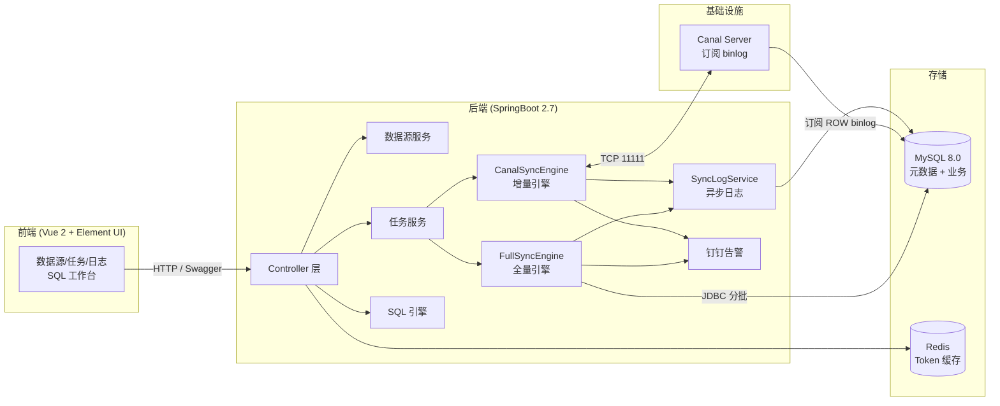
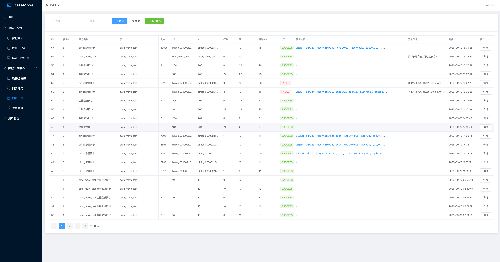

# DataMove 轻量 MySQL 数据同步工具

> 基于 **RuoYi-Vue 4.8.1 最新版** 前后端分离框架开发的 MySQL 专属数据同步工具


## 一、产品定位

- 面向中小企业 / 外包团队 / 个人 Java 运维的可视化、零代码 MySQL 数据同步工具
- 替代 DataX / Canal 复杂命令行配置
- 支持 **断点续传 + 钉钉告警 + 幂等同步**

## 二、技术栈

| 层级 | 技术 |
|------|------|
| 后端 | SpringBoot 2.7.18 + MyBatis-Plus 3.5.5 + Spring Security + JWT |
| 前端 | Vue 2.7 + Element UI 2.13 (RuoYi-Vue) |
| 持久层 | MyBatis-Plus 3.5 |
| 同步 | 原生 JDBC 分批 + Canal Client 1.1.7 增量 |
| 加密 | AES 对称加密 (BC) |
| 调度 | Spring `@Scheduled` + ThreadPool |
| 告警 | 钉钉 Webhook |
| 数据库 | MySQL 8.0 |

## 三、整体架构



前端只做展示与配置，同步动作全部落在后端引擎：全量走原生 JDBC 分批拉取，增量走 Canal Client 订阅 binlog，两者共用异步日志与钉钉告警。

## 四、目录结构

```
datamove/
├── pom.xml                       # 后端依赖
├── sql/datamove.sql              # 数据库初始化脚本
├── src/main/java/com/ruoyi/datamove/
│   ├── DatamoveApplication.java  # SpringBoot 启动类
│   ├── auth/                     # 登录 & 用户认证
│   ├── datasource/               # 数据源管理 (需求 3.1)
│   ├── task/                     # 同步任务管理 (需求 3.2)
│   ├── engine/                   # 同步核心引擎
│   │   ├── full/                 #   - 全量同步 (ID+Time 双模式+断点续传+幂等)
│   │   ├── incr/                 #   - Canal 增量同步
│   │   └── log/                  #   - 异步日志
│   ├── log/                      # 日志 Controller(导出 CSV)
│   └── common/                   # 全局异常处理
├── src/main/resources/
│   ├── application.yml
│   └── application-dev.yml
└── ruoyi-ui/                     # 前端(Vue 2 + Element UI)
    ├── vue.config.js
    └── src/
        ├── api/                  # 接口封装
        ├── views/sync/           # 数据源/任务/日志
        └── views/system/         # 用户管理
```

## 五、核心模块说明

### 5.1 数据源管理 - 对应文档 3.1
- 增 / 删 / 改 / 查
- **测试连接**:实时校验数据库连通性 + 账号权限
- 数据库密码 AES 加密,前端密文 (前 2 位 + **** + 后 2 位) 回显
- 删除前检查是否被任务引用

### 5.2 同步任务管理 - 对应文档 3.2
- 支持两种任务类型: **全量 (FULL) / 增量 (INCR-Binlog)**
- 全量同步两种模式:
  - **按主键 ID** (`WHERE id > #{lastId} ORDER BY id ASC LIMIT #{batchSize}`)
  - **按时间字段** (`WHERE time > #{lastTime} OR (time = #{lastTime} AND id > #{lastIdInBatch}) ORDER BY time ASC, id ASC LIMIT ...`)
- **断点续传**:整批 `INSERT ... ON DUPLICATE KEY UPDATE` 成功后才更新断点
- **幂等防重**:任务重跑不产生脏数据
- 任务操作:启动 / 暂停 / 继续 / 终止 / 查看日志
- **单实例保护**:同一任务只能有一个 worker 在跑
- **任务大盘** (`/sync/dashboard`):实时展示每个任务的 **行/秒**(10s 滑动窗口)、
  **ETA**(按源表总行数估算)、**当前批次**、**瓶颈库**(源库读取 对比 目标库写入耗时)、
  进度与总吞吐, 有任务运行时 3s 自动刷新

### 5.3 同步日志 - 对应文档 3.3
- 任务总进度 / 单批次明细日志 / 异常错误日志
- 支持按任务 ID、状态、表名筛选
- 支持 CSV 导出

### 5.4 钉钉告警 - 对应文档 3.4
- 全量任务运行失败 / 中断终止
- 增量 Binlog 断开 / 监听异常
- 数据源连接超时 / 失败
- 行数不一致

### 5.5 用户权限 - 对应文档 3.6
- **超级管理员 (admin)**:所有权限
- **普通操作员 (operator)**:仅查看任务、启停任务、查看日志
- 超级管理员账号内置,启动时强制首次修改密码

## 六、数据库表结构 - 对应文档 4

| 表 | 说明 |
|----|------|
| `sync_datasource` | 数据源配置 (密码 AES 加密) |
| `sync_task` | 同步任务主表 |
| `sync_task_progress` | **断点进度核心表** |
| `sync_task_log` | 同步日志 (含批次明细) |
| `sync_canal_position` | Canal 增量监听位点 |
| `sys_user / sys_role / sys_user_role / sys_menu / sys_role_menu` | RuoYi 框架权限 |

## 七、快速启动

### 1. 准备环境
- JDK 1.8+
- Maven 3.6+
- MySQL 5.7 / 8.x
- (可选)Canal Server 用于增量同步

### 2. 初始化数据库
```bash
mysql -uroot -p < sql/datamove.sql
```

### 3. 启动后端
```bash
mvn clean spring-boot:run
# 或打包: mvn package -DskipTests
```

启动成功后访问:
- 后端 API: `http://localhost:8080/`
- Swagger 文档: `http://localhost:8080/swagger-ui/index.html`

### 4. 启动前端
```bash
cd ruoyi-ui
npm install
npm run dev
```
打开 `http://localhost:80`,使用 `admin / admin123` 登录

### 5. 默认账号

| 账号 | 密码 | 角色 |
|------|------|------|
| admin | admin123 | 超级管理员 |

## 八、数据库初始化值


第一次登录后请立即:
1. 修改默认密码
2. 添加需要同步的源库 / 目标库
3. 创建第一个同步任务

## 九、增量同步前置准备 (Canal)

仅全量可跳过。启用增量前:
```sql
-- 1. 源库开启 binlog ROW 模式
SET GLOBAL binlog_format = 'ROW';


-- 3. Canal Server 部署参考官方文档
--    下载地址: https://github.com/alibaba/canal/releases
```

在 Canal 配置文件中指向源库,然后在 DataMove 创建增量任务时填写:
- Canal Host
- Canal Port (默认 11111)
- Canal Destination (canal 配置文件中 instance 名)

## 十、二期预留(本次未实现)

- DDL 表结构同步
- 多线程极速同步
- 数据脱敏
- 数据差异对账校验
- SaaS 多租户网页版
- PostgreSQL / Oracle 支持

---

## 十一、性能实测：10 万 / 100 万行全量同步

> 下列数字全部取自 `sync_task_log`（批次明细）与 `sync_task_progress`（断点记录）的真实落库数据，未做估算或美化。

### 11.1 测试环境

| 项 | 值 |
| --- | --- |
| MySQL | 8.0.41（Docker 单实例） |
| `innodb_buffer_pool_size` | 128 MB |
| `innodb_flush_log_at_trx_commit` | 1（每事务刷盘） |
| 源库 | `datamove` @ 127.0.0.1:3306（数据源「源库v2」） |
| 目标库 | `sys` @ 127.0.0.1:3306（数据源「目标库」） |
| 任务 | #1「全量数据同步」· FULL · ID 模式 · `overwrite_flag=1` |
| 测试表 | `data_move_test`，12 个字段 + 2 个二级索引，110 万行约 363 MB |
| 造数方式 | `INSERT ... SELECT` 数字表笛卡尔积，10 万 / 100 万各一批 |

> 源库与目标库是**同一个 MySQL 实例**，读和写在同一个 buffer pool 里循环，因此这是一组「单机上限」数据，真实跨机同步还要再扣掉网络 RTT 与带宽开销。

### 11.2 同步总耗时

两次均为 `overwrite_flag=1` 的覆盖式全量：先 `TRUNCATE` 目标表、清空断点，再从 `id > 0` 重新拉一遍全表。

| 用例 | 源表行数 | `batch_size` | 批次数 | **同步总耗时** | 吞吐 | 单行耗时 | 失败批次 |
| --- | --- | --- | --- | --- | --- | --- | --- |
| A：10 万行 | 100,023 | 10,000 | 12 | **18.0 s** | 5,545 行/秒 | 0.180 ms | 0 |
| B：100 万行 | 1,100,023 | 100,000 | 13 | **204.1 s** | 5,391 行/秒 | 0.186 ms | 0 |

- 总耗时口径：Σ 单批 `cost_ms`（首批开始取数 → 最后一批写入完成），与日志首末时间戳的墙钟差一致，说明批次之间没有空转。
- 用例 A 起止 `10:50:46 → 10:51:02`；用例 B 起止 `10:54:33 → 10:57:57`。
- 12 / 13 批中的最后两批是收尾：先取到剩余 23 行，再取一次空集确认到底，`while` 循环才退出。

### 11.3 批次明细

<details>
<summary><b>用例 A：10 万行（batch_size = 10,000，总耗时 18.0 s）</b></summary>

| 批次 | 日志区间 | 本批行数 | 累计 | 耗时 |
| --- | --- | --- | --- | --- |
| 1 | 185 → 10,184 | 10,000 | 10,000 | 1,993 ms |
| 2 | 10,185 → 20,184 | 10,000 | 20,000 | 1,808 ms |
| 3 | 20,185 → 30,184 | 10,000 | 30,000 | 1,683 ms |
| 4 | 30,185 → 40,184 | 10,000 | 40,000 | 1,806 ms |
| 5 | 40,185 → 50,184 | 10,000 | 50,000 | 1,813 ms |
| 6 | 50,185 → 60,184 | 10,000 | 60,000 | 1,910 ms |
| 7 | 60,185 → 70,184 | 10,000 | 70,000 | 1,755 ms |
| 8 | 70,185 → 80,184 | 10,000 | 80,000 | 1,734 ms |
| 9 | 80,185 → 90,184 | 10,000 | 90,000 | 1,732 ms |
| 10 | 90,185 → 100,184 | 10,000 | 100,000 | 1,792 ms |
| 11 | 100,185 → 100,207 | 23 | 100,023 | 8 ms |
| 12 | 100,207 → 100,207 | 0 | 100,023 | 4 ms |
| **合计** | **12 批** | **100,023** | — | **18,038 ms ≈ 18.0 s** |

</details>

<details>
<summary><b>用例 B：100 万行（batch_size = 100,000，总耗时 204.1 s）</b></summary>

| 批次 | 日志区间 | 本批行数 | 累计 | 耗时 |
| --- | --- | --- | --- | --- |
| 1 | 185 → 100,184 | 100,000 | 100,000 | 17,412 ms |
| 2 | 131,255 → 231,254 | 100,000 | 200,000 | 17,287 ms |
| 3 | 262,325 → 362,324 | 100,000 | 300,000 | 18,315 ms |
| 4 | 393,395 → 493,394 | 100,000 | 400,000 | 19,055 ms |
| 5 | 524,465 → 624,464 | 100,000 | 500,000 | 17,779 ms |
| 6 | 655,535 → 755,534 | 100,000 | 600,000 | 19,092 ms |
| 7 | 786,605 → 886,604 | 100,000 | 700,000 | 17,370 ms |
| 8 | 917,675 → 1,017,674 | 100,000 | 800,000 | 17,701 ms |
| 9 | 1,048,745 → 1,148,744 | 100,000 | 900,000 | **23,794 ms** |
| 10 | 1,179,815 → 1,279,814 | 100,000 | 1,000,000 | 18,667 ms |
| 11 | 1,310,885 → 1,410,884 | 100,000 | 1,100,000 | 17,595 ms |
| 12 | 1,410,885 → 1,410,907 | 23 | 1,100,023 | 9 ms |
| 13 | 1,410,907 → 1,410,907 | 0 | 1,100,023 | 5 ms |
| **合计** | **13 批** | **1,100,023** | — | **204,081 ms ≈ 204.1 s** |

</details>

### 11.4 结论

1. **线性度好，100 万行量级没有劣化**：数据量放大 11 倍，单行耗时只从 0.180 ms 涨到 0.186 ms（+3.3%），吞吐仅下降 2.8%。说明 `setFetchSize(batchSize)` 的流式读取确实生效——内存占用未随数据量膨胀，全程无 OOM、无 GC 抖动。
2. **`batch_size` 从 1 万放大到 10 万，吞吐几乎没变**：两次用例 `batch_size` 差 10 倍，吞吐只差 2.8%（且更大的批次略慢）。瓶颈**不在**网络往返 / 事务提交次数，而在单行写目标表（2 个二级索引维护 + 每批 `commit` 刷盘）。因此 `batch_size` 应按「失败回滚代价」来选，**推荐 1,000 ~ 10,000**。
3. **单批耗时存在 ~30% 的离群点**：用例 B 第 9 批 23,794 ms，比中位数 18,315 ms 高 30%，属 InnoDB checkpoint 刷脏页 + 二级索引页分裂造成的周期性写放大抖动，不是引擎逻辑问题。
4. **同步结果零差异**：同步结束后逐行比对源库与目标库，两边均 1,100,023 行，`username` / `phone` / `city` 字段不一致 0 行、目标库缺失 0 行。
5. **线性外推：1000 万行约 31 分钟**：按 5,391 行/秒，1000 万行单线程需要约 1,855 秒，这正是 Roadmap 中「按主键区间分片并行」的价值所在。

---

## 十二、效果图

### 首页


### SQL 工作台


### 任务大盘


### 同步任务


### 字段映射 (kettle 风格连线拖拽)


**动态演示** —— 按住源字段拖拽到目标字段建立映射, 连线中点的 × 可删除:


### 同步日志



## 十三、压测效果图


