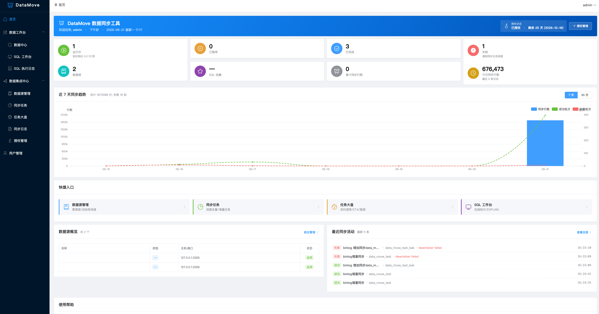
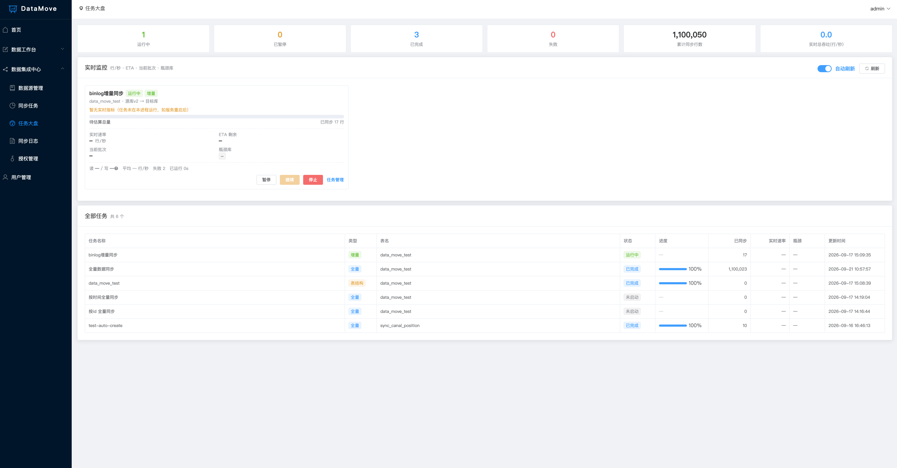
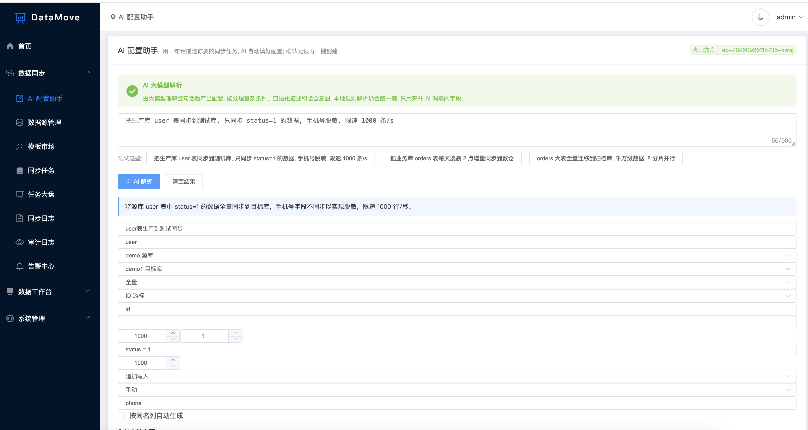
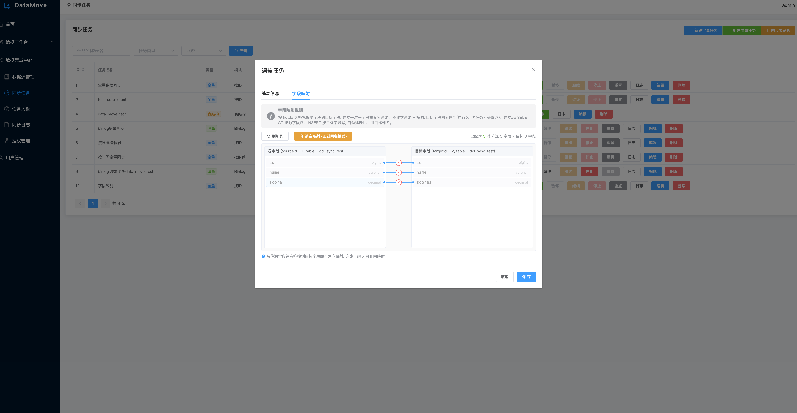
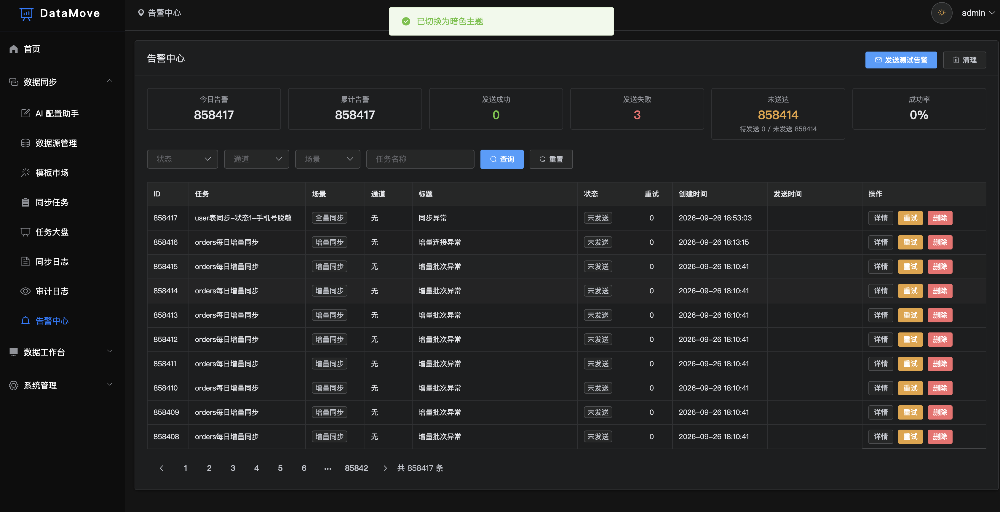

# DataMove 轻量 MySQL 数据同步工具

> 基于 **RuoYi-Vue 4.8.1 最新版** 前后端分离框架开发的 MySQL 专属数据同步工具

**GitHub**: <https://github.com/qingtiandatamove/datamove>
**Gitee**: <https://gitee.com/qingtian2023/datamove>

**一句话**：可视化零代码的 MySQL 同步工具 —— 页面点点选选就能跑任务，替代 DataX / Canal 的命令行与 JSON，自带断点续传、幂等同步、**数据校验与一键修复**。

## 项目亮点

| 亮点 | 说明 |
| --- | --- |
| 零侵入增量同步 | 基于 Canal 订阅源库 binlog ROW 模式，**不写源库、不加触发器** |
| 可视化零代码 | 页面点点选选即可跑任务，替代 DataX / Canal 的命令行与 JSON |
| 四步新建向导 | 「新建任务」走 **选源 → 选目标 → 选模式 → 字段映射** 四步向导：同步方式做成卡片选，目标表缺失自动提示先建表，字段映射支持一键自动配对同名列，批次/分片/告警等高级参数默认收起 |
| AI 配置助手 | 用一句话说人话就能配任务（例："每天凌晨2点把 demo 的 orders 全量同步到 demo1，排除 password 字段"），大模型直接解析出任务草稿并**逐字段给出解析依据 + 风险提示**；已有任务也能用"把同步时间改成每小时"这类话直接改（先预览差异再落库）。支持 DeepSeek / 通义千问 / 火山方舟 / 智谱 / 本地 Ollama 等任一 OpenAI 兼容服务，**没配 API Key 时自动降级本地规则解析**，详见 [5.9](docs/MODULES.md#59-ai-任务配置助手---用一句话建任务--改任务) |
| 迁移模板市场 | 内置 6 个场景模板（全量迁移 / 全量+增量不停机 / 业务→测试 / 业务→数仓 T+1 / 大表并行 / 敏感字段排除），**只填源库·目标库·表名即可一键套用出任务**，详见 [5.8](docs/MODULES.md#58-迁移模板市场---模板中心) |
| 数据校验 + 一键修复 | 源/目标双游标流式归并，定位到行/字段差异，一键补 INSERT / 修 UPDATE（**不删目标库数据**） |
| 断点续传 + 幂等 | 每批 `INSERT ... ON DUPLICATE KEY UPDATE` 成功才推进断点，重跑不脏数据 |
| 全量 + 增量双模式 | 全量按主键 ID / 时间字段分批拉取，增量用 binlog 实时订阅 |
| 定时调度 + 事件触发 | **CRON 定时 / 手动 / 事件触发** 三选一：定时带可视化 Cron 生成器；事件触发生成回调 URL，外部系统一个 `POST /sync/task/event/{token}` 即可拉起任务（令牌即密钥，免登录），任务运行中自动跳过本次触发 |
| 分片并行提速 | FULL+ID 模式按主键区间拆多线程并行，**1000 万行从 ~31 分钟降到数分钟** |
| binlog 事件过滤 | 服务端订阅收紧为「源库.任务表」，**DML 类型按需勾选**（如归档库只收 INSERT），**忽略字段**让 INSERT/UPDATE 不写指定列 —— 三层过滤避免无关事件污染下游 |
| 任务一键克隆 | 一键复制源任务全部业务配置，运行态字段（状态/位点/源表名）自动重置；克隆后强提示"请修改表名+任务名后再启动"，避免表名沿用导致重复消费 binlog |
| 在线 SQL 工作台 | 任意数据源直接写 SQL 跑，带 **CodeMirror 语法高亮 + 关键字/表名/字段智能补全**、**表结构助手**、**EXPLAIN 高危项标色**（ALL/index、filesort、大 rows）；单语句 30s 超时防卡死，支持 SQL 收藏 + 操作日志留痕 |
| 实时监控大盘 | 任务运行中展示速率、ETA、瓶颈库、分片实时状态，3s 自动刷新 |
| 钉钉告警 | 同步失败 / Binlog 断开 / 数据源超时 / 行数不一致，自动推送 Webhook |
| 字段级审计日志 | **谁 / 什么时候 / 改了哪个任务的哪个字段 (old → new)**，同次请求多字段共享 revision_id 可一键回放；覆盖 7 种操作类型，操作人 + IP + UA 全留痕；旧值红色删除线 + 新值绿色追加，**企业合规审计必备** |
| 运行历史留痕 | 每次启动一条记录，结果/耗时/行数/速率/异常，支持趋势图 + CSV 导出 |
| RBAC 权限体系 | 继承 RuoYi 完整用户/角色/菜单，admin 强制首次改密 |
| AES 密码加密 | 数据源密码入库前 AES 加密，前端密文回显（前 2 位 + **** + 后 2 位） |
| 轻量部署 | Spring Boot 单体 + Vue 2，单实例即可承接亿级行同步 |

## 技术栈

| 层级 | 技术 |
|------|------|
| 后端 | SpringBoot 2.7.18 + MyBatis-Plus 3.5.5 + Spring Security + JWT |
| 前端 | Vue 2.7 + Element UI 2.13 (RuoYi-Vue) |
| 同步 | 原生 JDBC 分批 + Canal Client 1.1.7 增量 |
| 校验 | 源/目标双游标流式归并比对 (`setFetchSize` 流式读取, 内存里只驻留一行) |
| 修复 | 按差异明细回放 INSERT(补缺失) / UPDATE(只改不一致的列), 不删目标库多余行 |
| 加密 | AES 对称加密 (BC) |
| 调度 | ThreadPoolTaskScheduler (CRON 定时) + HTTP 事件回调 |
| 告警 | 钉钉 Webhook |
| 数据库 | MySQL 8.0 |

## 快速启动

环境：JDK 1.8+ / Maven 3.6+ / MySQL 5.7 或 8.x（增量同步另需 Canal Server，见 [docs/CANAL.md](docs/CANAL.md)）

```bash
# 1. 初始化数据库
mysql -uroot -p < sql/datamove.sql

# 2. 启动后端
mvn clean spring-boot:run

# 3. 启动前端
cd ruoyi-ui && npm install && npm run dev
```

打开 `http://localhost:80`，用 `admin / admin123` 登录（超级管理员）。后端 API `http://localhost:8080/`，Swagger `http://localhost:8080/swagger-ui/index.html`。

首次登录后请立即：1. 修改默认密码　2. 添加源库 / 目标库　3. 创建第一个同步任务。

> 全新环境执行 `sql/datamove.sql` 即可，它已包含全部升级项。**老库升级**需按日期顺序执行 `sql/upgrade_*.sql` 脚本，见 [docs/DATABASE.md](docs/DATABASE.md)。

## 性能实测

Docker 单实例 MySQL 8.0.41，源库与目标库同实例（单机上限，真实跨机还要扣掉网络 RTT）：

| 用例 | 行数 | 总耗时 | 吞吐 |
| --- | --- | --- | --- |
| 10 万行 | 100,023 | **18.0 s** | 5,545 行/秒 |
| 100 万行 | 1,100,023 | **204.1 s** | 5,391 行/秒 |

- **线性度好**：数据量放大 11 倍，单行耗时只涨 3.3%，流式读取生效，全程无 OOM
- **`batch_size` 不是越大越好**：1 万与 10 万吞吐仅差 2.8%，**推荐 1000 ~ 10000**，按失败回滚代价选
- **零差异**：同步后逐行比对，两边均 1,100,023 行，字段不一致 0 行、目标库缺失 0 行

完整批次明细与测试环境参数见 [docs/BENCHMARK.md](docs/BENCHMARK.md)。

## 效果预览











完整 16 张截图（含 SQL 工作台、同步任务、同步日志、告警中心、审计日志、模板市场、压测）见 [docs/SCREENSHOTS.md](docs/SCREENSHOTS.md)。

## 文档导航

| 文档 | 适合谁 / 内容 |
|---|---|
| [GUIDE.md](GUIDE.md) | **新手操作人员** — 页面地图 + 五步上手 + 场景手册 + 名词表 + FAQ |
| [QUICKSTART.md](QUICKSTART.md) | **第一次接触, 想 5 分钟跑起来** — 含同类工具对比表 + 不适用场景 |
| [docs/MODULES.md](docs/MODULES.md) | **核心模块详解** — 数据源 / 同步任务 / 日志 / 告警 / 校验修复 / 权限 / 审计 / 模板市场 / AI 助手 |
| [docs/ARCHITECTURE.md](docs/ARCHITECTURE.md) | 整体架构 + 目录结构 |
| [docs/DATABASE.md](docs/DATABASE.md) | 数据库表结构 + 初始化值 + 老库升级脚本 |
| [docs/CANAL.md](docs/CANAL.md) | 增量同步前置准备（Canal Server 配置） |
| [docs/BENCHMARK.md](docs/BENCHMARK.md) | 10 万 / 100 万行全量同步性能实测明细 |
| [docs/SCREENSHOTS.md](docs/SCREENSHOTS.md) | 完整效果图（16 张） |
| [docs/ROADMAP.md](docs/ROADMAP.md) | 二期预留（本次未实现） |
| [LICENSING.md](LICENSING.md) | 哪些代码开源 / 哪些商业付费 / LicenseService 怎么配 |
| [BLOG.md](BLOG.md) | 开源介绍长文 |
| [JUEJIN.md](JUEJIN.md) | 掘金推广文章草稿 |

## 适合谁 / 不适合谁

- **适合**：中小企业 / 外包团队 / 个人 Java 运维，需要经常在 MySQL 之间搬数据，不想维护一堆 JSON 和命令行脚本
- **不适合**：异构数据源同步（本项目是 **MySQL 专属**）、超大规模实时数仓（那是 Flink / Kafka Connect 的地盘）

## 授权与开源边界

开源范围、商业授权与 `LicenseService` 配置见 [LICENSING.md](LICENSING.md)。
