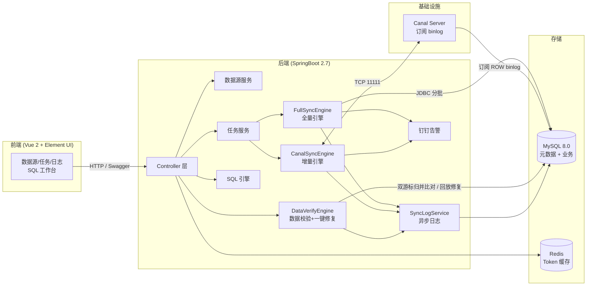

# 整体架构与目录结构

> 本文从 README 拆分而来, 完整索引见 [README](../README.md)

## 整体架构



前端只做展示与配置，同步动作全部落在后端引擎：全量走原生 JDBC 分批拉取，增量走 Canal Client 订阅 binlog，两者共用异步日志与钉钉告警。
数据校验是同步之外的**旁路只读体检**：源库与目标库各开一个流式游标做双指针归并，结果与差异明细落在自己的两张表里，既不占用同步线程，也不改写任务状态。

## 目录结构

```
datamove/
├── pom.xml                       # 后端依赖
├── sql/datamove.sql              # 数据库初始化脚本
├── src/main/java/com/ruoyi/datamove/
│   ├── DatamoveApplication.java  # SpringBoot 启动类
│   ├── auth/                     # 登录 & 用户认证
│   ├── datasource/               # 数据源管理 (需求 3.1)
│   ├── task/                     # 同步任务管理 (需求 3.2)
│   ├── audit/                    # 审计日志 (字段级变更追踪, 需求 3.7)
│   ├── engine/                   # 同步核心引擎
│   │   ├── full/                 #   - 全量同步 (ID+Time 双模式+断点续传+幂等)
│   │   ├── incr/                 #   - Canal 增量同步
│   │   ├── verify/               #   - 数据校验(差异对账 + 一键修复)
│   │   └── log/                  #   - 异步日志
│   ├── log/                      # 日志 Controller(列表/统计/导出 CSV/清理)
│   └── common/                   # 全局异常处理
├── src/main/resources/
│   ├── application.yml
│   └── application-dev.yml
└── ruoyi-ui/                     # 前端(Vue 2 + Element UI)
    ├── vue.config.js
    └── src/
        ├── api/                  # 接口封装
        ├── views/sync/           # 数据源/任务/日志
        └── views/system/         # 用户管理
```

