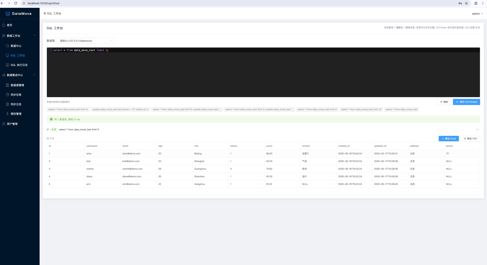
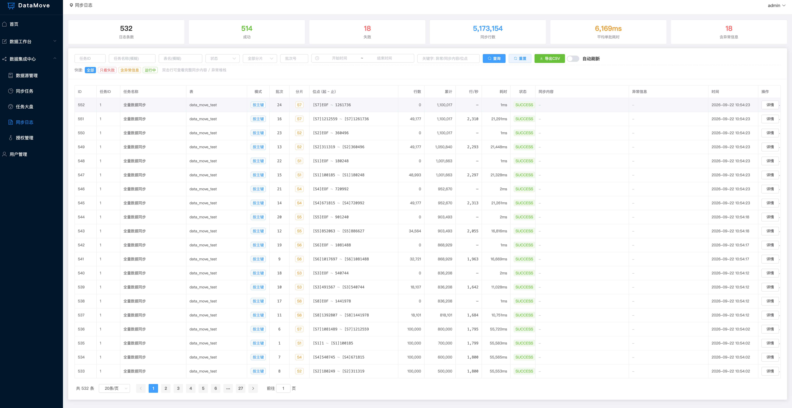
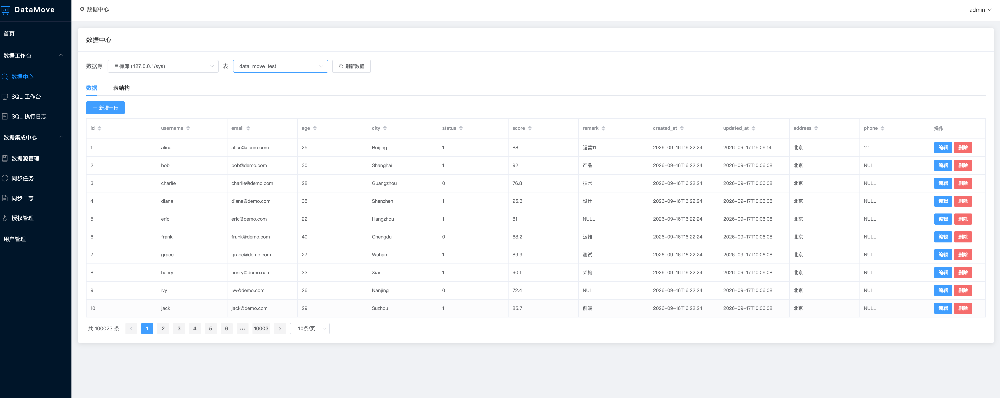
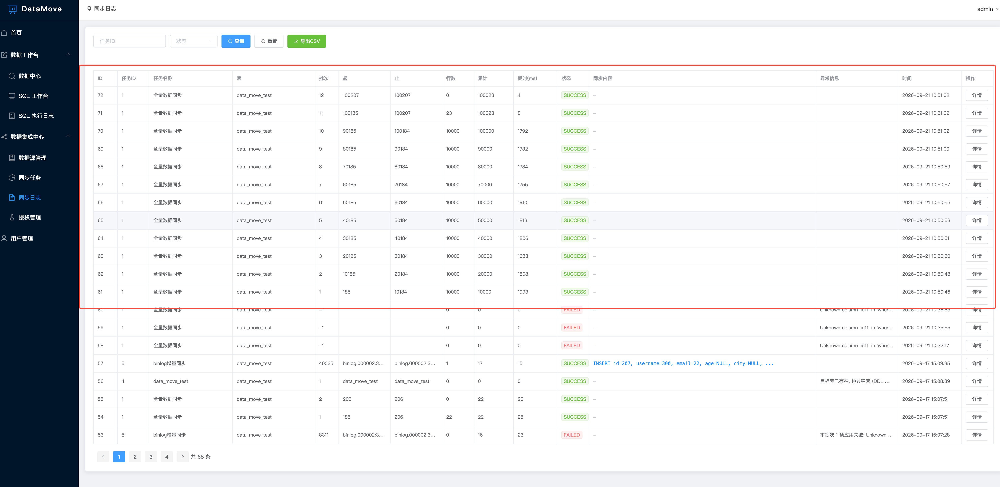

# 效果图

> 本文从 README 拆分而来, 完整索引见 [README](../README.md)

### 首页

### SQL 工作台

### 任务大盘

### 同步任务

### 字段映射 (kettle 风格连线拖拽)

### 同步日志

### 告警中心

### 审计日志

### 迁移模板市场

### AI 配置助手

一句话说人话，大模型直接给出任务草稿，并逐字段给出「为什么这么填」的解析依据与风险提示：

### 暗色主题

## 压测截图

